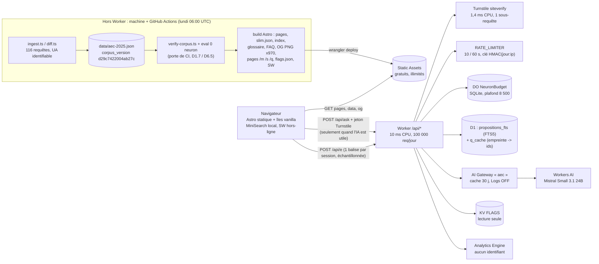

# 09 — Architecture de référence, budget, résilience, sécurité (T7)

Livrable de l'étape T7 du plan (`PLAN-SESSION.md`), rédigé le 9 septembre 2026 (14:00 UTC) à partir des cinq labos de `prototypes/labo-plateforme/` (`ai-gateway`, `do-budget`, `turnstile`, `d1-fts5`, `framework`), du spike T4 (`06-partage.md`), du registre `01-faits.md`, de la synthèse IA `08-ia.md` et des règles transverses `07-mecaniques.md` §7.11 (D5.8). App « C'est écrit là » (D10.2), corpus `d29c7422004ab27c` (D1.4), compte Cloudflare Free **sans moyen de paiement** (D0.2, D0.31).

Statuts : **VÉRIFIÉ** = mesuré aujourd'hui par un labo (commande, fichier ou URL cités) ou lu sur une page de doc datée ; **INFIRMÉ** = le plan le disait, la mesure dit le contraire ; **PROBABLE** = déduit d'un échantillon ou d'un texte ; **HYPOTHÈSE** = non testé, méthode de levée indiquée. Cette synthèse n'a fait **aucun appel Workers AI** (0 neuron, ligne ajoutée à `neurons-log.md` ; cumul session 5 332,73 / 8 000). Rien n'est commité.

---

> ## ⚠️ Amendements du 10 septembre 2026 — panel rouge T12
>
> **Ce document a été écrit le 9 septembre à 14:00 UTC, c'est-à-dire AVANT D6.10 (« chat livré en extractif pur, aucun LLM à l'exécution »), et il n'a pas été relu après.** Une fois le LLM retiré, **le Worker ne répond plus à aucun utilisateur** : il ne sert que la balise d'événements. Six affirmations opérationnelles de ce fichier deviennent fausses de ce seul fait. Elles sont amendées ci-dessous et à leur place dans le texte ; le reste du document tient ligne par ligne, et la démonstration du §4.3 (« 100 % fonctionnelle à 0 requête Worker ») est le socle de tout ce qui suit. Disposition complète : `13-tests-humains.md` §5 « Panel rouge (T12) » ; décisions **D12.8**, **D9.21**.
>
> | # | Ce que ce fichier dit | Ce qui est vrai depuis D6.10 | Où |
> |---|---|---|---|
> | 1 | Les flags vivent dans **KV**, lus par le Worker, « effet ≤ 60 s sans redéploiement » | **KV n'a plus aucun consommateur.** Un flag lu par un Worker que personne n'appelle **ne change aucun pixel** : `chat: off`, `wording.*` et surtout la dérogation `silence: on` ne sortent jamais du Worker. Le seul levier client est **`public/flags.json`**, statique, servi par Static Assets en **`Cache-Control: no-cache`** (revalidation ETag, **0 requête Worker**), jamais par le service worker en `stale-while-revalidate`, **lu au démarrage avant le premier appel à `effectiveDate()`**. Champs : `silence_override (auto\|on\|off)`, `chat`, `events`, `events_rate`, `wording`, `updated_at`, `reason` | §1.7, ADR-9, §9, R12 de `14-risques.md` |
> | 2 | « **action < 10 min sans redéploiement** », « `wrangler deploy` ≈ 1-2 min », fiche 2 « ≈ 5 min » | **Jamais chronométré** (H-PLA-18), et contredit par nos propres mesures : ≈ 2 900 cartes à **0,22-0,60 s de rendu local par carte** (`06-partage.md` §2.3) donnaient **15 à 25 min de rendu séquentiel** avant l'upload de ≈ 240 Mo — *recalculé le 10/9/2026 après D13.3 : **≈ 970 cartes**, soit **≈ 4 à 10 min** et ≈ 60 Mo*. À mesurer **une fois**, pour un build complet **et** pour un `npm run build:fast` (qui ne régénère ni cartes OG ni pages de partage), puis à écrire ici avec le fichier de mesure cité. `scripts/build-cards.ts` doit être **incrémental** : empreinte par carte = id + `corpus_version` + version de charte | §9, fiche 2 |
> | 3 | `EVENTS_SAMPLE_RATE` est une **`var` du Worker** (§2) | Le tirage est **côté client** (`12-positionnement-lancement.md` §10.5) : **la variable du Worker n'est lue par personne**, et deux documents décrivaient deux emplacements incompatibles pour la même valeur. Le taux et l'interrupteur vivent dans **`flags.json`** (`events`, `events_rate`), lus au démarrage ; `events: off` ⇒ **aucune requête émise** — c'est le seul « couper la mesure » qui économise le quota, un flag KV n'empêchant que l'écriture Analytics Engine, jamais la requête | §2, ADR-11 |
> | 4 | Scénario **C** modélise 100 000 requêtes hostiles sur **`/api/ask`** | `/api/ask` n'existe plus en v1/v2 : **`/api/e` est la seule route serveur**, un canal d'écriture publique sans Turnstile et sans compte, dont on publie ensuite les chiffres. Scénario C réécrit ci-dessous (§4.2) | §4.2 |
> | 5 | « **une seule balise par session** » (ADR-11) | Impossible par le mécanisme décrit : le site est un **multi-pages statique**, **chaque navigation interne est un `pagehide`**, donc une balise ; le dédoublonnage `sessionStorage` empêche de recompter un événement, pas d'émettre une requête. À k pages/session, les requêtes valent **k × sessions échantillonnées**. `pagehide` se déclenche aussi **à l'entrée en bfcache** (`event.persisted === true`) : balises en double à chaque retour arrière. **Modèle à trancher par l'utilisateur** (`prompt-final.md` §19.3 point 5) | ADR-11, §4.2 |
> | 6 | §6 « la carte des journalisations » | Elle **omettait la seule écriture terminale de la v1** : `sessionStorage` `aec.s` et `aec.s.sampled`. Ligne ajoutée. Conséquence juridique (D9.21) : on ne dit plus « pas de traceur, donc pas de consentement » — l'art. 82 vise **toute inscription d'informations** dans l'équipement terminal — on **revendique l'exemption CNIL de mesure d'audience** et on liste ses cinq conditions (`11-conformite.md` §6.2) | §6 |
>
> **Deux manques de méthode, relevés le même jour :** (a) **cinq labos de plateforme et aucun labo de charge** — la seule preuve de tenue est un échantillon de ≈ 60 chargements (§1.3) ; le sixième labo est spécifié en §8.2 ; (b) `wrangler.jsonc` (§2) conserve `triggers.crons`, dont l'unique tâche purge `q_cache` en D1 : sans `/api/ask`, c'est **un échec `scheduled` quotidien et parfaitement silencieux** (`observability.enabled: false`) dans le seul composant serveur du produit. Trancher H-PLA-26 **avant** d'écrire le premier `wrangler.jsonc`.

> ## ✅ Arbitrages du 10 septembre 2026 — D13.1 à D13.4 (utilisateur)
>
> **Ils tranchent les questions restées ouvertes au §19 de `prompt-final.md` et priment sur tout ce que ce fichier décrit ailleurs.**
>
> | # | Ce que ce fichier décrit | Ce qui est vrai en v1 et en v2 | Où |
> |---|---|---|---|
> | **D13.1** | Un Worker qui répond à `POST /api/ask` avec **D1 FTS5**, **`q_cache`**, un **DO de budget**, **Turnstile**, l'**AI Gateway** et un **cron de purge** | **Aucune route serveur, aucune base D1, aucun cache de questions.** La recherche est **100 % côté client** (MiniSearch, index ≈ 60 Ko gzip, 0,82 ms médian) et, **sans modèle en ligne (D6.10), le Worker n'a rien à présélectionner**. `d1_databases`, `q_cache`, `/api/ask`, `migrations/` et `triggers.crons` **sortent du `wrangler.jsonc` v1/v2** ; la seule route serveur est **`POST /api/e`**. Le labo `d1-fts5` reste une **preuve** pour un éventuel **contrat v3 « ids seuls »**, jamais une dépendance de la v1 | §1.1, §1.2, §1.4, **§2**, ADR-4, §4, §5, §6 |
> | **D13.2** | « hash de version dans le chemin » sans règle écrite | **L'identifiant seul dans l'URL, la version du corpus dans le chemin de l'image** : `/m/c12-s01-k01` **permanent**, `/og/<corpus_version>/m/c12-s01-k01.png` en `Cache-Control: immutable`. On régénère les images après un re-crawl **sans casser un lien déjà envoyé** | §1.5, `06-partage.md` §7 |
> | **D13.3** | « ≈ 2 900 cartes OG, ≈ 240 Mo » | **≈ 970 cartes, ≈ 60 Mo** : seul le **1200×630** est pré-généré au build (les robots d'aperçu n'exécutent pas de JavaScript) ; **carré et story sont dessinés dans le navigateur**, jamais sur le Worker | §1.1, §1.5 |
> | **D13.4** | `/defi/` daté, index calculé sur une date | **`/defi/<n>/`, chemin réel, 60 tirages figés**, aucune cadence ; `effectiveDate()` ne sert plus qu'au gel L49 du partage | `07-mecaniques.md` §8.4, §9.1 |
>
> **Ce que cela ne change pas** : le Worker orchestre et ne calcule pas (ADR-1) ; les cartes ne sont jamais rendues à la demande (ADR-2, D4.1) ; `flags.json` statique reste le seul support de flags client (D12.8).

## 0. En dix lignes

1. **Un seul Worker + Static Assets**, `run_worker_first: ["/api/*"]` : tout ce qui n'est pas `/api/*` est un fichier pré-généré, servi gratuitement et sans limite (doc du 23/4/2026, VÉRIFIÉ ; 0 invocation mesurée par le labo `framework`). Le Worker orchestre, il ne calcule pas : 10 ms de CPU (D4.1, VÉRIFIÉ).
2. **Framework : Astro 5 statique, CSS inline, îles minimales** — JS initial 1,5 Ko contre 64,7 Ko pour React + Vite ; LCP labo 935 ms contre 2 059 ms (VÉRIFIÉ, labo `framework`).
3. **Un HIT du cache AI Gateway coûte 0 token et ≈ 50 ms** (115 HIT mesurés, VÉRIFIÉ côté gateway ; PROBABLE côté compteur Workers AI jusqu'à la lecture du dashboard). Le cache est un match exact : normaliser la question et rendre le corps déterministe.
4. **Le budget vit dans un Durable Object SQLite gratuit** : plafond 8 500 (85 % de 10 000) respecté à l'unité, atomique sous 40 requêtes parallèles, 18 ms de RPC, remise à zéro par clé de jour UTC (VÉRIFIÉ).
5. **Le rate limiting binding ne protège pas le quota** : compteur par serveur, 140 requêtes scriptées sans un seul 429 (INFIRMÉ « par datacenter »). Il reste un anti-rafale gratuit pour navigateurs ; l'anti-script est Turnstile, l'arithmétique est le DO.
6. **Turnstile invisible : 0 cookie**, une clé `localStorage` de sécurité dans l'origine `challenges.cloudflare.com` (VÉRIFIÉ sur défi échoué / HYPOTHÈSE sur défi réussi) ; CSP minimale suffisante ; 1,4 ms de CPU par vérification ; le défi ne passe pas en automatisation (9/9 échecs).
7. **D1 FTS5 gratuit fonctionne** (tokenizer `unicode61 remove_diacritics 2`, qualité égale à MiniSearch, 1,7 ms CPU, 118 lignes lues par question) : c'est la présélection **côté serveur** de `/api/ask` — ⛔ **v3 seulement (D13.1, 10/9/2026)** : en v1 et en v2, **toute** la recherche est côté client, hors-ligne, à 0 requête et 0 base.
8. **Coût de la fiabilité en neurons** : 40,0 neurons/question mesurés (v1), 25-30 projetés (v2) ⇒ le LLM sert au plus **212 à 283 questions nouvelles par jour** ; le reste passe par la FAQ, le glossaire, les caches et l'extractif — l'app est complète à 0 neuron (D0.21, §4.3).
9. **Aucune journalisation involontaire** : `observability.enabled: false`, AI Gateway Logs OFF + `collectLog: false`, clé de rate limit HMAC salée par jour, cache D1 par empreinte, DO = deux entiers, Analytics Engine sans identifiant (§6). Ce qui reste et qu'on déclare : le stockage local Turnstile, NEL de la zone, les journaux d'hébergeur de Cloudflare.
10. **Ce que le labo n'a pas prouvé** (§10) : le CPU cumulé d'une invocation `/api/ask` complète (somme des labos ≈ 5-7 ms p50, p99 à risque), la lecture dashboard « HIT = 0 neuron », les captures Logs OFF / Billing, le temps jusqu'au jeton Turnstile sur téléphone, le LCP sur Android réel en 4G.

## 1. Architecture de référence

### 1.1 Principe

**Statique d'abord, IA en surcouche, mode dégradé designé** (D0.2). Trois plans :

| Plan | Ce qui y vit | Quota | Statut |
|---|---|---|---|
| **Build (hors Worker)** : machine de session + GitHub Actions | Ingestion et re-crawl hebdo (D1.3), vérification adversariale (D1.7), projection `slim.json` (D4.2), index de recherche, glossaire, FAQ, riposte, pools de jeux (§7.11), **≈ 970 cartes OG PNG 1200×630** (D4.1 ; ≈ 60 Mo — *le carré et la story passent côté navigateur, D13.3*), pages de partage `/m/`, `/s/`, `/q/`… avec leurs balises OG, `flags.json`, `exactitude.html` | Aucun (Actions gratuites pour un dépôt public) | VÉRIFIÉ (scripts T1/T4 existants) / HYPOTHÈSE (pipeline complet à assembler) |
| **Static Assets** (gratuits, illimités) | Tout le site Astro, `/data/*.json` hachés, polices, cartes OG, pages de partage, manifest PWA et service worker, `flags.json` | 20 000 fichiers / 25 Mio par fichier (limits, 5/9/2026) | VÉRIFIÉ : « Requests to static assets are free and unlimited » (https://developers.cloudflare.com/workers/static-assets/billing-and-limitations/, 23/4/2026) ; 0 ligne `workersInvocationsAdaptive` sur 3 Workers assets-only (labo `framework`) |
| **Worker `/api/*`** (100 000 req/jour, 10 ms CPU) | **En v1 et v2 : `POST /api/e` seulement** (événements Analytics Engine) — *amendé le 10/9/2026 par D13.1*. `POST /api/ask` (chat), `GET /api/search` et le cron de purge **ne reviennent qu'avec le contrat v3 « ids seuls »** | 100 000 requêtes/jour, 10 ms CPU, 50 sous-requêtes | VÉRIFIÉ (https://developers.cloudflare.com/workers/platform/limits/, 5/9/2026) |

Ce qui a changé par rapport au plan : la route d'événements `/e` (D5.1, D5.10) devient **`/api/e`** pour que `run_worker_first` ne contienne qu'un préfixe (proposition D7.9) ; les pages de partage `/m/<id>` du spike, rendues par le Worker, deviennent des **fichiers HTML pré-générés** (le Worker ne rend plus rien, D4.1).

### 1.2 Diagramme



> ⛔ **Amendé le 10/9/2026 par D13.1 : ce diagramme est celui du contrat v3.** En v1 et en v2, les branches `POST /api/ask`, Turnstile, `RATE_LIMITER`, `DO NeuronBudget`, `D1`, `AI Gateway`, `Workers AI` et `KV FLAGS` **n'existent pas**. Il ne reste que **`client → Static Assets`** (tout le produit) et **`client → Worker (POST /api/e) → Analytics Engine`**.

### 1.3 Briques, rôle, limite gratuite, preuve

| Brique (binding) | Rôle dans l'app | Limite Free (source) | Ce que le labo a mesuré | Statut |
|---|---|---|---|---|
| Worker (`/api/*`) | Orchestration d'une question IA, balise d'événements, cron de purge | 100 000 req/jour ; 10 ms CPU ; 50 sous-requêtes ; dépassement `/api/*` ⇒ **429** sans toucher au statique (billing-and-limitations, 23/4/2026) | Par brique : Turnstile 1,4 ms, RL 0,64 ms, DO 0,72 ms, FTS5 1,66 ms, appel IA ≈ 3 ms (p50, GraphQL) | VÉRIFIÉ par brique / **HYPOTHÈSE pour la somme** (§8.3, §10) |
| Static Assets (`ASSETS`) | Tout le reste | Gratuits, illimités ; 20 000 fichiers ; 25 Mio/fichier | 0 invocation comptée sur ≈ 60 chargements + curl (labo `framework`) | VÉRIFIÉ (doc) / PROBABLE (mesure échantillonnée) |
| Workers AI (`AI`) via AI Gateway `aec` | Sélection pure d'ids par Mistral Small 3.1 (D6.2-D6.3) | 10 000 neurons/jour, reset 00:00 UTC ; 300 req/min | 40,0 neurons/question v1 ; MISS 1,0-2,2 s ; HIT 32-64 ms, 0 token ; `collectLog: false` accepté par le binding (workers-types 5.20260908.1), gateway authentifié appelé par le binding sans en-tête (200) | VÉRIFIÉ |
| D1 (`DB`) — **retirée de la v1/v2 (D13.1)** | `propositions_fts` (présélection serveur) + `q_cache` (empreinte → ids) — **contrat v3 seulement** | 5 M lignes lues / 100 000 écrites par jour ; 5 Go (plan §3.2, VÉRIFIÉ le 7/9) ; dépassement = erreur, jamais facturation (D0.31) ; `rows_written_24h` lisible par `wrangler d1 info` (labo `d1-fts5`) | Chargement 2 835 écritures ; 118 lignes lues/question p50 (474 p95) ; SQL < 2 ms ; hit cache = 1 lecture, miss = 3 écritures | VÉRIFIÉ |
| Durable Object SQLite (`NEURON_BUDGET`) | Compteur global du jour, plafond 8 500, `reserve` / `release` / `status` | 100 000 req/jour ; 100 000 lignes écrites ; SQLite seul backend sur Free (https://developers.cloudflare.com/durable-objects/platform/pricing/) | 265 acceptées, 266ᵉ refusée ; 40 parallèles = 1 280 exact ; p50 44 ms bout en bout, RPC 18 ms ; 0,72 ms CPU | VÉRIFIÉ |
| Rate limiting (`RATE_LIMITER`) | Anti-rafale navigateur sur `/api/ask` (10 / 60 s par clé HMAC) | Périodes 10 ou 60 s ; « permissive, eventually consistent » (https://developers.cloudflare.com/workers/runtime-apis/bindings/rate-limit/) | Compteur **par serveur** : 100 séquentielles + 40 en rafale sur connexions neuves = 0 × 429 ; keep-alive : 21 ok puis 429 ; `limit()` non compté en sous-requête | VÉRIFIÉ ; **INFIRMÉ** « par datacenter » |
| Turnstile (widget `0x4AAAAAAEt3fczgKFO-ViPf`, hostname `cestecritla.fr`) | Preuve de navigateur avant tout appel IA | Défis illimités ; **20 widgets** ; 10 hostnames/widget ; branding non retirable si visible ; analytics 7 j (https://developers.cloudflare.com/turnstile/plans/) | 0 cookie ; 1 clé `localStorage` tierce ; CSP minimale 0 violation ; 600010 en automatisation ; secret valide (`invalid-input-response` en 8 ms) | VÉRIFIÉ ; le plan disait « illimité » : **requalifié** (défis oui, widgets non) |
| KV (`FLAGS`) | Flags en lecture seule : kill switch chat, silence électoral, wording | 100 000 lectures / **1 000 écritures** par jour (https://developers.cloudflare.com/kv/platform/limits/, 21/4/2026) | Non prototypé (usage trivial) | VÉRIFIÉ (limites) / HYPOTHÈSE (câblage) |
| Analytics Engine (`ANALYTICS`) | 6 événements agrégés par session, sans identifiant (D5.1) | 100 000 points écrits / 10 000 requêtes SQL par jour ; rétention 3 mois ; 250 points par invocation (https://developers.cloudflare.com/analytics/analytics-engine/pricing/ et `/limits/`, 23/4/2026) | Non prototypé | VÉRIFIÉ (limites) / HYPOTHÈSE (câblage) |
| Cron Trigger — **retiré (D13.1)** | Purge `q_cache` expirée, une fois par nuit — **la table n'existe plus**, un cron conservé échouerait chaque nuit en silence | 5 par compte ; 10 ms CPU | Non prototypé | VÉRIFIÉ (limite) |
| Règle de rate limiting **de zone** (WAF) | Bloquer un script sur `/api/*` avant le Worker | **1 règle** sur Free, caractéristique IP, période ≥ 10 s (https://developers.cloudflare.com/waf/rate-limiting-rules/, 25/8/2026) | Non testé | PROBABLE (les requêtes bloquées par le WAF n'invoquent pas le Worker et ne comptent pas dans les 100 000) |

### 1.4 Chemin d'une question (`POST /api/ask`) — ⛔ **contrat v3 seulement (D13.1, 10/9/2026)**

> **En v1 et en v2, ce chemin n'existe pas** : la question est traitée **entièrement sur l'appareil** (FAQ exacte, carte glossaire, retrieval A local), à 0 requête. Les dix étapes ci-dessous sont conservées pour que la réouverture éventuelle ne se réinvente pas.

Le client fait d'abord tout ce qu'il sait faire seul, à 0 requête : FAQ exacte (D2.5), carte glossaire (D2.1), recherche locale A (D6.1) ; il affiche le résultat extractif **immédiatement**, puis, si l'écran chat est actif et le flag `chat` allumé dans `flags.json`, il demande la sélection IA. L'appel n'existe donc que pour les questions où l'IA apporte quelque chose (08-ia.md §7.1).

```
client : q normalisée (trim, NFC, casse, apostrophes, espaces) + jeton Turnstile (turnstile.execute(), usage unique)
 1. garde-fous          : POST JSON ≤ 2 Ko, q ≤ 300 caractères, Origin = cestecritla.fr, jeton présent (sinon 400/403, 0 sous-requête)
 2. Turnstile           : siteverify (secret), success ∧ action = "ask" ∧ hostname ∈ liste → sinon 403 `degraded`
 3. RATE_LIMITER        : limit({ key: HMAC(jour:ip) }) → sinon 429 `degraded` (Retry-After 60)
 4. FLAGS (KV, cache 60 s par isolat) : chat = off ∨ silence L49 actif → 200 `off` / `silence` (+ wording)
 5. NEURON_BUDGET       : reserve(40) → refus ⇒ 200 `quota` (resetAt) ; accepté ⇒ on continue
 6. D1 q_cache          : SELECT par empreinte sha256(corpus_version + prompt_version + termes normalisés triés) → HIT ⇒ release(40) en waitUntil, 200 `cache`
 7. D1 FTS5             : présélection déterministe « top 10 ∪ 2 sections » (1 requête OR bm25, ids triés)
 8. AI Gateway → Mistral: corps = prompt système versionné + candidats + q ; cacheTtl 30 j, collectLog false
                          HIT ⇒ release(40) en waitUntil ; MISS ⇒ settle(usage.neurons) en waitUntil ; erreur / > 6 s ⇒ release(40), 200 `degraded`
 9. validateur          : ids ⊂ candidats, ≤ 3, liant_kind ∈ énumération, glossary_term ∈ cartes → sinon 200 `degraded`
10. q_cache INSERT (waitUntil, 3 écritures) ; réponse { mode, ids, liant_kind, glossary_term, wording? } en no-store
```

Réponse toujours 200 avec un `mode` ∈ { `ai`, `cache`, `degraded`, `quota`, `off`, `silence` } : le client ne distingue jamais une panne d'un choix (08-ia.md §1 clause 3). La latence perçue est celle de l'extractif local (< 100 ms) ; le remplacement du liant et de l'ordre arrive ≈ 150 ms (cache) ou 1-2 s (modèle) plus tard — HYPOTHÈSE « pas une panne », à juger T11.

Pourquoi le DO **avant** les caches (ordre de défense du plan) : `reserve` garantit qu'aucune requête ne franchit le plafond même en rafale (40 parallèles = exact, VÉRIFIÉ) ; un HIT libère la réservation hors du chemin critique. Coût : 2 requêtes DO par question servie en cache au lieu de 1 (100 000/jour disponibles ; §4). Si le compteur DO approchait sa limite (≥ 40 000 questions/jour), inverser 5 et 6 (D1 avant DO) coûte une ligne de code et perd la garantie stricte sur les HIT seulement, qui ne coûtent rien.

### 1.5 Ingestion, re-crawl, build : hors Worker (D1.3), OG au build (D4.1)

- **Jamais de crawl depuis un Worker** : `scripts/ingest.ts` (116 requêtes, concurrence 4, UA identifiable) et `scripts/diff.ts` tournent sur la machine ou dans GitHub Actions le lundi à 06:00 UTC, ouvrent une PR ; `verify-corpus.ts` (D1.7) et le harnais à 0 neuron (D6.5 : retrieval, FAQ, glossaire, rejeu du validateur sur `eval/generation-raw.jsonl`) sont la porte de CI. VÉRIFIÉ (scripts et essai à blanc T1).
- **Le build produit tout ce que le Worker ne doit pas calculer** : `slim.json` (69 166 o gzip, D4.2), index MiniSearch sérialisé, glossaire, FAQ, riposte, pools de jeux avec version et graine (§7.11 règles 1-2), **cartes OG** (`prototypes/spike-share/src/cards` devient un script de build : satori 0.32 + resvg sur la machine, **≈ 970 PNG 1200×630**, 43-132 Ko chacun, **≈ 60 Mo** — VÉRIFIÉ pour les tailles, PROBABLE pour le volume total ; *amendé le 10/9/2026 par D13.3 : le carré 1080×1080 et la story 1080×1920 sont dessinés dans le navigateur au partage, avec le même code de carte*), **écrites sous `/og/<corpus_version>/…` en `Cache-Control: immutable`** (D13.2 : le lien public `/m/<id>` reste permanent, seule l'URL de l'image change au re-crawl), pages de partage HTML avec balises OG (une par id ; `rel=canonical` inter-domaines **retiré** le 10/9, remplacé par le lien visible « Lire sur melenchon2027.fr » et le JSON-LD `isBasedOn` / `citation`), `exactitude.html` (D6.6) et `flags.json`.
- **Rendu d'image à la demande rejeté** : 137-283 ms de CPU médian par carte contre 10 ms (VÉRIFIÉ, `06-partage.md` §2.3 ; 33-75 % de 503 « 1102 »). Le carré et la story passent **côté client (Canvas 2D), tranché le 10/9/2026 par D13.3** : les robots d'aperçu n'exécutent pas de JavaScript, donc seul le 1200×630 doit exister au build. H-PAR-6 devient une **exigence de test** (qualité du PNG sur un Android moyen), plus une hypothèse ouverte.
- **Nombre de fichiers** *(recalculé le 10/9/2026 après D13.3)* : ≈ **970** OG + ≈ 1 100 pages de partage + site + données ≈ **2 600 fichiers** et ≈ **60 Mo**, sous les 20 000 (VÉRIFIÉ limite / PROBABLE compte ; ≈ 4 500 fichiers et ≈ 240 Mo avec les trois ratios, écartés).

### 1.6 PWA hors-ligne, versionnage, invalidation — HYPOTHÈSE (non prototypée)

- L'app est **complète sans service worker** (D3.5) ; le SW est une amélioration : pré-cache du shell, de `/data/slim.<hash>.json`, de l'index, du glossaire et des polices ; stratégie « cache d'abord » pour les fichiers hachés (`immutable`, `_headers`), « réseau d'abord, repli cache » pour les pages HTML ; `/api/*` jamais mis en cache ; `offline.badge` / `offline.lead` / `offline.chat` (`design/strings.json`) quand `navigator.onLine` est faux ou qu'un `fetch` échoue.
- **Versionnage** : chaque fichier de données porte un hash de contenu dans son nom ; `/data/manifest.json` (petit, `max-age=300`) liste `corpus_version`, `glossary_version`, `build_id`. Le nom du cache SW = `build_id`. Un déploiement = nouveau SW = `activate` supprime les anciens caches ; le client compare `manifest.json` au démarrage et propose « Mettre à jour » sans rechargement forcé (jamais pendant un jeu en cours).
- **Invalidation croisée** : la même `corpus_version` entre dans la clé du cache D1, dans le corps des requêtes AI Gateway (donc dans sa clé SHA-256) et sur `/exactitude` : changer de corpus vide naturellement les trois (D1.4 ; VÉRIFIÉ pour le mécanisme de clé du gateway, doc caching 27/8/2026).
- Limite connue : Turnstile (`api.js` tiers) n'est pas mis en cache par le SW ; hors ligne, le chat est simplement absent (`offline.chat`).

### 1.7 Flags (KV, lecture seule) et `flags.json` (statique)

> ⛔ **Amendé le 10/9/2026 (panel rouge T12, D12.8). En v1 et en v2, la colonne « KV » n'a aucun consommateur** : le Worker ne sert que la balise `/api/e`, donc un flag lu dans KV **ne peut changer aucun pixel chez un visiteur**. Le tableau ci-dessous décrit l'architecture **avec** `/api/ask`, conservée pour que la réouverture ne se réinvente pas. **Support unique en v1/v2 : `public/flags.json`**, statique, `Cache-Control: no-cache`, lu au démarrage **avant** `effectiveDate()`, jamais mis en cache par le service worker en `stale-while-revalidate`. Champs : `silence_override (auto|on|off)`, `chat`, `events`, `events_rate`, `wording`, `updated_at`, `reason`. **Le délai n'est pas « ≤ 60 s »** : c'est celui d'un déploiement d'urgence, à mesurer (amendement n° 2 en tête de fichier).

Deux supports pour deux consommateurs, aucun sondage client du Worker (un sondage coûterait une requête Worker par visite : 10 000 visiteurs/h × 24 = 240 000/jour > 100 000) :

| Flag | Consommateur | Support | Délai d'effet | Écriture |
|---|---|---|---|---|
| `chat` : `on` / `off` (kill switch) | Worker `/api/ask` | KV `FLAGS`, clé `flags` (un JSON) | ≤ 60 s (cache par isolat) | `npx wrangler kv key put --binding FLAGS flags "$(cat ops/flags.json)"` (1 000 écritures/jour, on en fait 1) |
| `silence` : `auto` / `on` / `off` (L49, D0.24) | Worker et client | KV pour le Worker ; **dates de build** dans `effectiveDate()` (§7.11 règle 7, test unitaire T9) pour le client ; `flags.json` statique comme forçage manuel | Worker ≤ 60 s ; client : redéploiement ≈ 2 min | idem + `wrangler deploy` |
| `wording` : surcharges de `quota.*`, `silence.*`, `chat.ai_mention` | Worker (renvoyées dans la réponse `/api/ask`) | KV | ≤ 60 s | idem |
| `ai_model`, `prompt_version` | Worker | `vars` de `wrangler.jsonc` (redéploiement) | ≈ 1 min | `wrangler deploy` |

Le Worker lit `FLAGS` une fois par isolat toutes les 60 s (variable de module non liée à une requête : autorisé par les bonnes pratiques Workers, contrairement à l'état de requête). Aucun flag n'est lu par le client depuis KV.

## 2. `wrangler.jsonc` esquissé

> ⛔ **Amendé le 10/9/2026 par D13.1 — cette esquisse est celle du contrat v3.** Le `wrangler.jsonc` **réellement déployé en v1 et en v2** ne contient que : `name`, `main`, `compatibility_date`, `compatibility_flags`, `routes` (custom domains), `workers_dev: false`, `preview_urls: false`, `assets` (avec `run_worker_first: ["/api/*"]`), `analytics_engine_datasets`, `observability.enabled: false`, `minify`, `upload_source_maps: false`, `keep_vars: false`.
>
> **Sept blocs sortent**, chacun annoté ci-dessous dans le code : `ai` (D6.10) ; **`d1_databases` et `migrations_dir` (D13.1)** ; `durable_objects` + `migrations` (plus de budget de neurons) ; `ratelimits` (il ne couvrirait plus que la balise et **détruirait la mesure derrière un CGNAT**, §4.2) ; `kv_namespaces` (**aucun consommateur**, D12.8) ; `triggers.crons` (l'unique cron purge `q_cache`, table qui n'existe plus : conservé, il ferait **échouer un `scheduled` chaque nuit, en silence**, avec `observability.enabled: false`) ; et les `vars` `AI_*`, `TURNSTILE_*`, `BUDGET_*`, `Q_CACHE_TTL_DAYS`.
>
> **Ils ne reviennent qu'avec le contrat v3 « ids seuls »** (`08-ia.md` §7 bis, trois preuves exigées). Le labo `prototypes/labo-plateforme/d1-fts5` reste au dépôt comme leur preuve.

Champs vérifiés contre `node_modules/wrangler/config-schema.json` (wrangler **4.130.0**, Node 24.14 via nvm) : `assets.run_worker_first`, `ratelimits` (champ de premier rang), `analytics_engine_datasets`, `kv_namespaces`, `d1_databases`, `durable_objects` + `migrations.new_sqlite_classes`, `observability.enabled`, `triggers.crons`. Les identifiants `<à créer>` sont produits par `wrangler kv namespace create FLAGS` et `wrangler d1 create cestecritla` ; `Env` est généré par `wrangler types`, jamais écrit à la main.

```jsonc
{
  // "C'est écrit là" — production Worker (Free plan, no payment method: D0.2, D0.31).
  // One Worker: Static Assets for everything, the script only for /api/*.
  "$schema": "./node_modules/wrangler/config-schema.json",
  "name": "cestecritla",
  "main": "src/worker/index.ts",
  "compatibility_date": "2026-09-09",
  "compatibility_flags": ["nodejs_compat"],

  // Custom domains under the Free zone (D10.2). workers.dev stays off in production
  // so that the only public origin is the .fr (CSP, Turnstile hostnames, OG URLs).
  "routes": [
    { "pattern": "cestecritla.fr", "custom_domain": true },
    { "pattern": "www.cestecritla.fr", "custom_domain": true }
  ],
  "workers_dev": false,
  "preview_urls": false,

  // Astro static output (labo framework: output 'static', inlineStylesheets 'always').
  // Everything under ./dist is served by Static Assets: free, unlimited, no CPU limit.
  // Only /api/* reaches the script; over the daily request limit, /api/* answers 429
  // and the static site keeps working (static-assets/billing-and-limitations, 23/4/2026).
  "assets": {
    "directory": "./dist",
    "binding": "ASSETS",
    "html_handling": "auto-trailing-slash",
    "not_found_handling": "404-page",
    "run_worker_first": ["/api/*"]
  },

  // Workers AI, always through the AI Gateway "aec" (authenticated, Logs OFF, Cache ON).
  // The gateway id, cacheTtl and collectLog:false are passed in code:
  //   env.AI.run(model, input, { gateway: { id: "aec", cacheTtl: 2592000, collectLog: false } })
  // v1/v2: REMOVED (D6.10, no runtime model). Returns with the v3 "ids only" contract.
  "ai": { "binding": "AI" },

  // D1: propositions_fts (FTS5, server-side candidate selection) + q_cache (hash -> ids).
  // Schema and loads live in ./migrations (wrangler d1 migrations apply cestecritla --remote).
  // v1/v2: REMOVED (D13.1, 10/9/2026). No server route, no D1 database, no question cache:
  // search runs 100 % client-side (MiniSearch) and, with no online model (D6.10), the Worker
  // has nothing to preselect. ./migrations goes away with it. Both return ONLY with the v3
  // "ids only" contract; prototypes/labo-plateforme/d1-fts5 is kept as the proof for that day.
  "d1_databases": [
    {
      "binding": "DB",
      "database_name": "cestecritla",
      "database_id": "<à créer : wrangler d1 create cestecritla>",
      "migrations_dir": "./migrations"
    }
  ],

  // Global daily neuron budget: one SQLite-backed object (the only backend on Free),
  // hard stop at 8 500 = 85 % of 10 000, UTC day key, alarm at 00:00 UTC for comfort.
  // v1/v2: REMOVED (D6.10). No neurons to budget without a runtime model.
  "durable_objects": {
    "bindings": [{ "name": "NEURON_BUDGET", "class_name": "NeuronBudget" }]
  },
  "migrations": [{ "tag": "v1", "new_sqlite_classes": ["NeuronBudget"] }],

  // Anti-burst for well-behaved browsers only (counter is per server, not global: labo do-budget).
  // Key = HMAC-SHA256(RL_SALT_SECRET, utcDay + ":" + ip), 16 bytes, never logged.
  // v1/v2: REMOVED (panel T12, 10/9/2026). With /api/ask gone it would only cover the beacon,
  // and behind a mobile CGNAT it throws away the measurement of thousands of visitors.
  "ratelimits": [
    { "name": "RATE_LIMITER", "namespace_id": "2027", "simple": { "limit": 10, "period": 60 } }
  ],

  // Read-only feature flags (kill switch, silence électoral, wording). Written by the
  // operator with `wrangler kv key put`, read once per isolate per minute.
  // v1/v2: REMOVED (D12.8). No consumer: flags live in public/flags.json, read by the client.
  "kv_namespaces": [{ "binding": "FLAGS", "id": "<à créer : wrangler kv namespace create FLAGS>" }],

  // Aggregated events, no identifier (D0.22, D5.1): one data point per session, sampled client-side.
  "analytics_engine_datasets": [{ "binding": "ANALYTICS", "dataset": "cel_events" }],

  // Nightly purge of expired q_cache rows (DELETE ... WHERE expires_at < ?), 1 of 5 free crons.
  // v1/v2: REMOVED (D13.1). q_cache no longer exists, so this handler would fail every night
  // against an absent D1 binding — silently, since observability is off.
  "triggers": { "crons": ["17 3 * * *"] },

  // Non-secret configuration. Secrets are set with `wrangler secret put` and never appear here:
  //   TURNSTILE_SECRET  < ~/.aec-turnstile-secret   (siteverify)
  //   RL_SALT_SECRET    (HMAC salt for the rate-limit key; openssl rand -hex 32)
  // v1/v2: AI_*, TURNSTILE_*, BUDGET_* and Q_CACHE_TTL_DAYS are all REMOVED (D6.10, D13.1).
  "vars": {
    "AI_MODE": "live",                                   // replay | off | live (D6.7); CI and dev use replay
    "AI_MODEL": "@cf/mistralai/mistral-small-3.1-24b-instruct",
    "AI_GATEWAY_ID": "aec",
    "AI_PROMPT_VERSION": "v2-selection-1",               // part of the request body => part of the cache key
    "AI_MAX_TOKENS": "60",
    "AI_TIMEOUT_MS": "6000",
    "BUDGET_RESERVE_NEURONS": "40",                      // measured v1 cost; settled to usage.neurons on MISS
    "TURNSTILE_SITEKEY": "0x4AAAAAAEt3fczgKFO-ViPf",
    "TURNSTILE_ACTION": "ask",
    "TURNSTILE_HOSTNAMES": "cestecritla.fr,www.cestecritla.fr",
    "TURNSTILE_SEND_REMOTEIP": "false",
    "Q_CACHE_TTL_DAYS": "30",                            // v1/v2: REMOVED with q_cache (D13.1)
    // "EVENTS_SAMPLE_RATE": "0.1"  <- RETIRE le 10/9/2026 (panel rouge T12, D12.8) : le tirage est
    //   cote client, cette var du Worker n'etait lue par personne. Le taux vit dans public/flags.json
    //   (`events`, `events_rate`), lu au demarrage ; `events: off` => aucune requete emise.
  },

  // No logs at all in production (D0.22): no invocation logs, no console persistence, no traces.
  // CPU and error rates are read from GraphQL workersInvocationsAdaptive, which needs no logs
  // (verified: labo d1-fts5 ran with observability disabled and still had CPU quantiles).
  "observability": { "enabled": false },

  "minify": true,
  "upload_source_maps": false,
  "keep_vars": false
}
```

Notes de configuration :

- `limits.cpu_ms` n'existe que pour le modèle « standard » payant : sur Free la limite est fixe (10 ms), rien à déclarer.
- Pas d'environnement `staging` : la préproduction est `wrangler dev` en `AI_MODE=replay` (0 neuron) ; un déploiement de test se fait sur un Worker au nom différent, jamais sur le domaine.
- `.dev.vars` (ignoré par git) porte les secrets locaux ; la clé de test Turnstile `1x0000000000000000000000000000000AA` y suffit (labo `turnstile`).
- `wrangler check startup` avant chaque déploiement (limite 1 s ; les labos démarrent en 4-7 ms).

## 3. ADR (architecture decision records)

Format : contexte → décision → limite chiffrée → preuve / URL. Toutes sont des **propositions** (§10) sauf mention « reprend D… ».

### ADR-1 — Le Worker orchestre, il ne calcule pas (10 ms de CPU)

- **Contexte** : Free = 10 ms de CPU par invocation, « built-in flexibility » pour des dépassements rares, terminaison si dépassement répété (limits, 5/9/2026). Le spike T4 a mesuré 137-283 ms par carte satori et 33-75 % de 503 « 1102 » (VÉRIFIÉ).
- **Décision** : un seul Worker, `run_worker_first: ["/api/*"]` ; aucun rendu, aucune indexation, aucun crawl à l'exécution ; toute charge > 1 ms est soit faite au build, soit déléguée à une brique (D1, DO, AI) dont le Worker n'attend que le résultat. Toute nouvelle route passe par la mesure GraphQL `workersInvocationsAdaptive` (méthode `06-partage.md` §2.3) avant fusion.
- **Limite chiffrée** : budget cible par invocation `/api/ask` ≤ 6 ms p50 / ≤ 10 ms p99 ; briques mesurées séparément : 1,4 + 0,6 + 0,7 + 1,7 + ≈ 3 ms (p50, VÉRIFIÉ) — la somme est une **HYPOTHÈSE** à mesurer sur le prototype intégré (§8.3).
- **URL** : https://developers.cloudflare.com/workers/platform/limits/ ; `06-partage.md` §2.3 ; reprend D4.1.

### ADR-2 — Cartes OG et pages de partage pré-générées au build

- **Contexte** : D4.1 (VÉRIFIÉ) ; Static Assets gratuits et illimités ; 20 000 fichiers max.
- **Décision** *(amendée le 10/9/2026 par D13.3 et D13.2)* : `scripts/build-cards.ts` (code du spike) produit **≈ 970 PNG 1200×630** — le carré et la story sont **dessinés dans le navigateur** au partage — et ≈ 1 100 pages HTML de partage avec balises OG, les images sous **`/og/<corpus_version>/…` en `immutable`** ; le Worker ne sert plus aucune page de partage ; un id inconnu = 404 statique ; objets combinatoires (`/res/`, `/carte#bitmap`) = aperçu générique (D4.1, D5.8 règle 4).
- **Limite chiffrée** *(recalculée le 10/9/2026 après D13.3)* : ≈ **2 600** fichiers / 20 000 ; ≈ **60 Mo** (PROBABLE ; ≈ 4 500 fichiers et ≈ 240 Mo avec les trois ratios, écartés) ; PNG ≤ 132 Ko < 300 Ko (VÉRIFIÉ) ; 0 ms de CPU Worker par aperçu.
- **URL** : https://developers.cloudflare.com/workers/static-assets/billing-and-limitations/ ; `06-partage.md` §2.2, §4.

### ADR-3 — Framework : Astro 5 statique, CSS inline, îles minimales

- **Contexte** : D0.9 (framework choisi par micro-prototype mesuré), D3.5 (JS initial < 100 Ko gzip, LCP labo < 2,5 s, chemin critique ≤ 150 Ko). Labo `framework` : même page, mêmes données, mêmes polices, comportement prouvé identique (0,012 % de pixels différents, mêmes résultats sur 9 runs).
- **Décision** : Astro 5 `output: 'static'` sans adaptateur, `build.inlineStylesheets: 'always'`, servi en Static Assets ; îles en TypeScript vanilla d'abord ; île Preact/React via `@astrojs/react` seulement pour un composant qui le justifie (chat), chargée `client:visible`/`client:idle` et comptée par chunk ; Tailwind v4 reste possible (`@tailwindcss/vite`). React 19 + Vite en rendu client est **écarté pour l'écran 0**.
- **Limite chiffrée** (VÉRIFIÉ, Lighthouse 13.4.1, CPU ×4 / Slow 4G, médiane de 3) : JS initial **1 517 o** (Astro) contre **64 726 o** (React) ; LCP **935 ms** contre **2 059 ms** (React pré-rendu : 929 ms mais 64,7 Ko de JS et 431 ms de thread principal) ; chemin critique 54 894 o contre 118 231 o ; premier résultat de recherche ≈ 1,25 s dans les trois (coût = `slim.json` 68,7 Ko + indexation 200-224 ms, indépendant de la pile).
- **URL** : `prototypes/labo-plateforme/framework/README.md`, `docs/discovery/perf/2026-09-09/labo-framework-*.json`.

### ADR-4 — Retrieval : variante A côté client (MiniSearch) ; ~~D1 FTS5 côté serveur~~ → **client seul en v1/v2 (amendé le 10/9/2026 par D13.1)**

- **Contexte** : D6.1 (A retenue : rappel@5 0,81, index 60 Ko gzip, < 1 ms) ; le Worker ne doit pas faire confiance à une liste de candidats envoyée par le client (falsification, cache empoisonné) et ne peut pas construire l'index MiniSearch à l'exécution (200-224 ms d'indexation à CPU ×4 côté client, VÉRIFIÉ, soit ≫ 10 ms côté Worker — PROBABLE). Labo `d1-fts5` : FTS5 sur D1 gratuit VÉRIFIÉ, qualité égale à réglage égal (rappel@5 0,773 contre 0,765 sans alias ; 0,792 contre 0,813 avec alias).
- **Décision amendée (D13.1, 10/9/2026)** : **toute** la recherche est **côté client**, à 0 requête et 0 route serveur — il n'y a ni `/api/ask`, ni `/api/search`, ni base D1 en v1 et en v2. **Le motif est mécanique** : sans modèle en ligne (D6.10), **le Worker n'a rien à présélectionner** ; une présélection serveur ne servirait qu'un consommateur qui n'existe pas. Le volet FTS5 ci-dessous **ne revient qu'avec le contrat v3 « ids seuls »**, et le labo `d1-fts5` est conservé comme sa preuve.
- **Décision d'origine (v3 seulement)** : la recherche de l'app (glossaire, FAQ longue traîne, extractif, hors-ligne) reste **côté client** à 0 requête ; `/api/ask` recalcule les candidats « top 10 ∪ 2 sections » avec **D1 FTS5, une requête OR bm25, préfixe ≥ 3, sans étage AND** (INFIRMÉ : aucun gain, 1,97 requête au lieu de 1) ; alias glossaire/FAQ en 2ᵉ requête seulement si le CPU intégré le permet (+ 2,2 ms mesurés) ; réponse = ids seuls. `GET /api/search` reste un repli serveur optionnel pour un client sans JS (HYPOTHÈSE de besoin ; il coûterait une requête Worker par recherche).
- **Limite chiffrée** (VÉRIFIÉ) : 1 requête D1, **118 lignes lues p50 / 474 p95 / 614 max** ⇒ ≈ 10 000 questions/jour au p95 dans les 5 M de lectures ; SQL 0,8 ms p50 ; CPU 1,66 ms p50 / 2,65 ms p99 ; latence 51 ms p50 depuis la machine ; chargement 2 835 écritures (2,8 % du quota), base 1,15 Mo. Même `retrieval-core.ts` pour les deux normalisations (48 302 tokens vérifiés identiques).
- **URL** : https://developers.cloudflare.com/d1/sql-api/sql-statements/ (FTS5 supporté) ; `prototypes/labo-plateforme/d1-fts5/results/bench-results.md`.

### ADR-5 — Cache AI Gateway : un HIT = 0 neuron, sous condition de corps déterministe

- **Contexte** : la doc est muette sur le coût d'un HIT ; le plan demandait un test empirique. Labo `ai-gateway` : 119 requêtes, **115 HIT servis en 32-64 ms avec 0 token attribué** (GraphQL `aiGatewayRequestsAdaptiveGroups`), 4 MISS = 10,18 neurons ; `usage.neurons` d'un HIT est une relecture (2,5375 sur 115 HIT) ; une espace finale ou une majuscule ⇒ MISS (22 tokens) ; `skipCache: true` ⇒ MISS, entrée conservée.
- **Décision** : tout appel passe par `gateway: { id: "aec", cacheTtl: 2592000, collectLog: false }` ; la question est normalisée (trim, espaces, casse, apostrophes, NFC, ponctuation finale) ; le corps ne contient que des éléments stables (prompt versionné, candidats triés, question) — ni horodatage, ni `metadata`, ni identifiant ; le compteur DO **n'est jamais décrémenté sur un HIT** (`cf-aig-cache-status !== 'MISS'` ⇒ `release`) ; invalidation par version du corpus et du prompt (clé SHA-256 du corps complet, doc caching 27/8/2026), aucune purge nécessaire.
- **Limite chiffrée** : TTL maximum 1 mois (doc) ; HIT p50 53 ms, MISS 1,0-2,2 s ; CPU Worker ≈ 3 ms par invocation à 1 appel IA (VÉRIFIÉ). **Verdict HIT vs neurons : VÉRIFIÉ côté gateway (0 token, 11-53 ms, aucune inférence possible sur un 24B), PROBABLE côté compteur Workers AI** (jeu GraphQL `aiInferenceAdaptiveGroups` ingéré avec > 37 min de retard et échantillonné) — la lecture du dashboard tranche (§10).
- **URL** : https://developers.cloudflare.com/ai-gateway/features/caching/ ; `prototypes/labo-plateforme/ai-gateway/README.md` §3.

### ADR-6 — Budget : Durable Object SQLite à 85 %, clé de jour UTC, décrément sur MISS seulement

- **Contexte** : 10 000 neurons/jour, dépassement = erreur (jamais facturation, D0.31) ; le budget doit être global, exact et atomique. La règle générale « pas de DO global unique » (skill `durable-objects`) est ici sans objet : le compteur du jour **est** l'atome de coordination, et le débit attendu (≤ 300 réservations/jour, pics de 40) est 10⁴ fois sous la limite douce de 1 000 req/s par objet.
- **Décision** : `NeuronBudget`, instance unique `getByName("global")`, RPC `reserve(cost)` / `release(cost)` / `settle(reserved, actual)` / `status()` ; plafond dur 8 500 ; remise à zéro par **clé de jour UTC** dans chaque opération (l'alarme de 00:00 UTC n'est qu'un confort) ; réservation de 40 (coût v1 mesuré) ajustée au `usage.neurons` réel sur MISS ; refus ⇒ `mode: "quota"` avec `resetAt`.
- **Limite chiffrée** (VÉRIFIÉ) : 265 réservations acceptées, la 266ᵉ refusée (8 480 + 32 > 8 500) ; 40 parallèles ⇒ `used` = 1 280 exact ; RPC 18 ms p50, 44 ms bout en bout ; 0,72 ms CPU ; file d'attente : 40 simultanées ⇒ p50 296 ms, max 403 ms ; 11 tests `node:test` (bornes 23:59:59.999Z / 00:00:00.000Z, 29 février). DO Free : 100 000 requêtes et 100 000 écritures/jour ⇒ ≈ 300 questions = 0,3 %. Alarme posée à `2026-09-10T00:00:00Z`, déclenchement non observé (PROBABLE).
- **URL** : https://developers.cloudflare.com/durable-objects/platform/pricing/ ; https://developers.cloudflare.com/durable-objects/platform/limits/ ; `prototypes/labo-plateforme/do-budget/README.md`.

### ADR-7 — Rate limit binding = anti-rafale par serveur ; quota = DO ; anti-script = Turnstile + règle de zone

- **Contexte** : le plan disait « par datacenter ». Labo `do-budget` : 100 requêtes séquentielles et 40 en rafale sur connexions neuves = **0 × 429** pour une limite de 20/min ; seule une connexion persistante est limitée (21 puis 429) ; convergence non observée en 20 s ; doc : « permissive, eventually consistent… counters cached on the same machine ».
- **Décision** : garder le binding (gratuit, 0,64 ms, `limit()` non compté en sous-requête, les 429 ne coûtent rien) comme **frein pour navigateurs** sur `/api/ask` (10 / 60 s par clé HMAC(jour:ip)) ; ne jamais lui confier une arithmétique ; le quota est dans le DO ; l'anti-script est Turnstile (défi impossible en automatisation : 9/9 échecs 600010) ; ajouter **la règle de rate limiting de zone** (1 sur Free, IP, ≥ 10 s) sur `/api/*` pour arrêter un script mono-IP avant le Worker.
- **Limite chiffrée** : binding 10 req / 60 s / clé (permissif d'une unité) ; règle de zone proposée : > 30 requêtes / 10 s par IP sur `/api/*` ⇒ bloc 10 s (PROBABLE : les requêtes bloquées n'invoquent pas le Worker, donc ne comptent pas dans les 100 000 — à vérifier au dashboard Security → Events).
- **URL** : https://developers.cloudflare.com/workers/runtime-apis/bindings/rate-limit/ ; https://developers.cloudflare.com/waf/rate-limiting-rules/ (25/8/2026) ; INFIRME le plan §3.2.

### ADR-8 — Turnstile invisible, uniquement sur l'écran chat, siteverify dans le Worker

- **Contexte** : le chat est la seule action qui consomme un quota ; D3.5 dit « zéro tiers » ; Turnstile est un tiers par construction (`api.js` 27 423 o gzip + iframe). Labo `turnstile` : 0 cookie (9 passes, 4 moteurs/modes, 0 `Set-Cookie`), une clé `localStorage` `cf.turnstile.u` (149 car., persistante, sans expiration) dans l'origine `challenges.cloudflare.com`, cloisonnée par site (PROBABLE) ; hôtes contactés : `challenges.cloudflare.com`, `hagen.challenges.cloudflare.com`, rien d'autre ; CSP minimale suffisante.
- **Décision** : widget invisible (`appearance: interaction-only`, rendu explicite, `action: "ask"`), chargé **seulement** sur l'écran chat, jamais sur l'accueil ni sur une page de partage ; jeton à usage unique par question (`turnstile.execute()`), vérification canonique dans le Worker (`success` ∧ `action` ∧ `hostname`), `remoteip` non envoyé, pas de pré-clearance (elle poserait `cf_clearance`) ; échec ⇒ `mode: "degraded"` sans message d'erreur.
- **Limite chiffrée** (VÉRIFIÉ) : `/verify` 1 367 µs CPU p50 / 3 050 µs p99, 1 sous-requête, ≈ 120 ms bout en bout ; défis illimités, **20 widgets** par compte (le plan disait « illimité »), 10 hostnames/widget, sous-domaines couverts par le racine ; branding non retirable si le widget devient visible. **Temps jusqu'au jeton sur téléphone : HYPOTHÈSE** (mesure humaine, README §5 du labo).
- **URL** : https://developers.cloudflare.com/turnstile/plans/ ; https://developers.cloudflare.com/turnstile/reference/content-security-policy/ ; https://www.cloudflare.com/turnstile-privacy-policy/ ; `docs/discovery/captures/2026-09-09/labo-turnstile/`.

### ADR-9 — Flags KV en lecture seule ; `flags.json` statique pour le client

- **Contexte** : D0.24 (gel partiel par flag), plan T7 (kill switch chat, wording) ; KV = 100 000 lectures mais **1 000 écritures**/jour ; un sondage client coûterait des requêtes Worker.
- **Décision** : un seul document JSON `flags` dans KV (`chat`, `silence`, `wording`, `updated_at`), lu par le Worker une fois par isolat par minute, jamais par le client ; le client tient `effectiveDate()` (dates L49 au build, test unitaire) et `flags.json` statique (forçage manuel par redéploiement, ≈ 2 min) ; la réponse `/api/ask` transporte le `wording` surchargé.
- **Limite chiffrée** : 1 écriture par changement (limite 1 000/jour) ; ≤ 1 lecture KV par isolat par minute (≪ 100 000) ; effet ≤ 60 s côté Worker.
- **URL** : https://developers.cloudflare.com/kv/platform/limits/ (21/4/2026) ; reprend D0.24.
- ⛔ **AMENDÉ le 10/9/2026 (panel rouge T12, D12.8).** Cette ADR décrit une architecture où le Worker répond aux utilisateurs. **Depuis D6.10 il ne sert que la balise `/api/e`** : un flag lu dans KV **ne change aucun pixel**, et « effet ≤ 60 s côté Worker » ne veut plus rien dire côté visiteur. **Décision de remplacement pour la v1 et la v2** : `public/flags.json`, statique, servi par Static Assets en **`Cache-Control: no-cache`** (revalidation ETag, **0 requête Worker**), **jamais** en `stale-while-revalidate` dans le service worker, **lu au démarrage avant le premier appel à `effectiveDate()`** ; champs `silence_override (auto|on|off)`, `chat`, `events`, `events_rate`, `wording`, `updated_at`, `reason`. **`kv_namespaces` sort de `wrangler.jsonc`** tant que `/api/ask` n'existe pas. Le délai réel est celui d'un `npm run build:fast && wrangler deploy`, **à chronométrer** (amendement n° 2).

### ADR-10 — Aucun log en production : observabilité off, AI Gateway Logs OFF, pas de `console.log` de texte

- **Contexte** : une question politique rattachable est une donnée sensible (RGPD art. 9, D0.22). Les logs d'invocation Workers portent URL et métadonnées client ; AI Gateway journalise prompt et réponse **par défaut** (100 000 logs sur Free).
- **Décision** : `observability.enabled: false` (aucun log, aucune trace persistée) ; gateway « aec » avec Logs OFF au dashboard **et** `collectLog: false` dans le code ; interdiction de `console.*` sur tout contenu client (question, candidats, ids cités, jeton, IP, UA) — seules des lignes structurées `{ route, mode, status, ms }` sont tolérées en développement ; `wrangler tail` jamais lancé sur la production ; les métriques (CPU, erreurs, taux de HIT) viennent de GraphQL (`workersInvocationsAdaptive`, `aiGatewayRequestsAdaptiveGroups`) qui n'ont pas besoin de logs.
- **Limite chiffrée** : 0 log stocké ; GraphQL disponible avec `observability.enabled: false` (VÉRIFIÉ, labo `d1-fts5`) ; `cf-aig-log-id` est renvoyé même avec Logs OFF (ne prouve rien) ; la preuve « Logs vide » est une capture dashboard (HYPOTHÈSE jusqu'à la capture, §10).
- **URL** : https://developers.cloudflare.com/workers/observability/ ; `prototypes/labo-plateforme/ai-gateway/README.md` §5.

### ADR-11 — Analytics Engine : un point par session, sans identifiant, échantillonné côté client

- **Contexte** : D0.22 (Analytics Engine seul, aucun script tiers), D5.1 (6 événements, métrique nord N) ; 100 000 points/jour ; chaque balise est une requête Worker (100 000/jour partagées avec le chat).
- **Décision** : le client accumule ses 6 compteurs (arrivée par lien, `SectionVerbatim` atteint, passage jeu → lecture…, chapitre, mode de réponse `cache`/`ai`/`degraded`, seau de latence) et envoie **une seule balise** `POST /api/e` (`sendBeacon` à `pagehide`), avec une probabilité `EVENTS_SAMPLE_RATE` (0,1) tirée sans graine persistante ; le Worker écrit un `writeDataPoint` (blobs : chapitre, mode, seau ; doubles : compteurs ; index : jour) ; aucun IP, UA, id ou texte ; le mot inconnu (D0.22) est un blob **par occurrence**, sans phrase.
- **Limite chiffrée** : à 240 000 sessions/jour et 10 % ⇒ 24 000 requêtes + 24 000 points (24 %) ; à 100 % ⇒ 240 000 > 100 000 requêtes (le chat serait coupé) : l'échantillonnage est obligatoire au-delà de ≈ 3 000 sessions/h ; rétention Cloudflare 3 mois (doc) ; purge D0.22 « 30 jours » = ne requêter que les 30 derniers jours (la rétention n'est pas réglable).
- **URL** : https://developers.cloudflare.com/analytics/analytics-engine/pricing/ ; `/limits/` (23/4/2026) ; amende D5.10 (`/e` → `/api/e`).
- ⛔ **AMENDÉ le 10/9/2026 (panel rouge T12).** Trois points de cette ADR ne tiennent pas.
  1. **« Une seule balise par session » est irréalisable par ce mécanisme.** Le site est un **multi-pages statique** (Astro `output: 'static'`, URLs distinctes `/m/`, `/s/`, `/c/`, `/q/`, `/defi/`) : **chaque navigation interne est un `pagehide`**, donc une balise. Le dédoublonnage en `sessionStorage` empêche de recompter un **événement**, pas d'émettre une **requête**. À k pages vues par session, les requêtes valent **k × sessions échantillonnées** : à k = 3 et 100 000 visiteurs/heure, l'échantillon à 10 % produit **30 000 requêtes/heure** et les 100 000 requêtes/jour sont épuisées en **3 h 20**, pas en 24 h. Et `pagehide` se déclenche aussi **à l'entrée en bfcache** (`event.persisted === true`) : balises en double à chaque retour arrière — **à ignorer explicitement**. **Deux modèles possibles, à trancher par l'utilisateur** (`prompt-final.md` §19.3 point 5) : « une balise **par page vue** » avec `RATE` divisé par k, ou « une balise **par session** » avec un verrou `aec.s.sent` **et** l'accumulation des compteurs en `sessionStorage` (et non en mémoire de page), en écrivant ce qui est perdu. Mesurer k sur le funnel réel (`02-funnel-personas.md`) **avant** de figer un chiffre, et poser un test Playwright « 4 pages, combien de `POST /api/e` ».
  2. **`EVENTS_SAMPLE_RATE` n'est pas une `var` du Worker** : le tirage est côté client. Le taux et l'interrupteur vivent dans `flags.json` (`events`, `events_rate`) ; `events: off` ⇒ **aucune requête émise** (un flag KV n'empêche que l'écriture Analytics Engine, jamais la requête, qui est la ressource rare).
  3. **Le taux de 10 % détruit la seule mesure du projet sans rien protéger.** La règle « aucun taux publié sous 200 sessions échantillonnées » exige alors ≈ 2 000 arrivées par lien sur 7 jours, quand la diffusion planifiée est un groupe d'action, deux boucles, un message Discord et deux posts. Le plafond étant de 100 000 points/jour pour 3-4 points par session, la saturation n'arrive qu'à **25 000-33 000 sessions/jour** : **`RATE = 1,0` en v1**, réversible et tracé par `app_version`, garde-fou horaire conservé (« au-delà de 3 000 requêtes/heure sur `/api/e`, passer `events_rate` à 0,02 »).

### ADR-12 — La version du corpus (hash) est la clé de tout : cache, PWA, page exactitude

- **Contexte** : D1.4 (corpus figé et versionné par hash), D1.3 (re-crawl hebdo), actualisation du programme annoncée par l'officiel (01-faits.md).
- **Décision** : `corpus_version` (+ `prompt_version`, `glossary_version`) entre dans : le nom des fichiers de données (`slim.<hash>.json`, `immutable`), `manifest.json` et le nom du cache SW, la clé `q_cache` de D1, le corps des requêtes AI Gateway (donc sa clé), la page `/exactitude` et les pools de jeux publiés (§7.11 règles 1-2). Un re-crawl qui change une empreinte ⇒ nouvelle version ⇒ tous les caches deviennent froids **sans purge** ; le cron de purge ne fait que libérer l'espace.
- **Limite chiffrée** : coût d'une invalidation = 1 redéploiement + ≈ 300 MISS AI Gateway au pire (≤ 12 000 neurons étalés par le DO) ; 0 écriture KV.
- **URL** : reprend D1.4, D1.3 ; https://developers.cloudflare.com/ai-gateway/features/caching/.

### ADR-13 — Ingestion, re-crawl et bench hors Worker ; porte de CI à 0 neuron

- **Contexte** : D1.3, D6.5 ; un Worker ne doit ni crawler (116 requêtes, robots) ni bencher (neurons) ; les 10 ms de CPU interdisent de toute façon un parseur HTML à l'exécution.
- **Décision** : GitHub Actions lundi 06:00 UTC (re-crawl → PR de diff) ; sur chaque PR : `verify-corpus.ts`, tests FAQ/glossaire/jeux, `eval/retrieval.ts` avec seuils (hit@5 ≥ 0,95, rappel@10 ≥ 0,85, rappel@3 sections ≥ 0,90), rejeu du validateur, **0 neuron** ; bench réel (≥ 40 items, plafond dans le harnais, ligne automatique dans `neurons-log.md`) avant tout changement de prompt, modèle, corpus ou strings de liant ; le Worker n'a aucun accès au dépôt ni au site officiel.
- **Limite chiffrée** : CI 0 neuron ; bench ≈ 1 000-1 300 neurons (v2, 40 items) hors production (après un reset).
- **URL** : `scripts/README.md`, `.github/workflows/recrawl.yml`, `eval/harness.ts` ; reprend D1.3, D1.7, D6.5.

## 4. Tableau de coût

### 4.1 Limites du plan gratuit et dégradation associée

> ⛔ **Amendé le 10/9/2026 par D13.1 (après D6.10).** En v1 et en v2, **quatre lignes seulement s'appliquent** : **Requêtes Worker** (la balise `POST /api/e` est la seule route serveur), **CPU Worker**, **Analytics Engine** et **Static Assets**. **Workers AI, AI Gateway, D1, Durable Objects, KV, Turnstile et Cron n'ont aucun consommateur** : elles décrivent le contrat v3. Le quota réellement exposé est donc **les 100 000 requêtes Worker**, et **rien du produit ne s'arrête** quand il est atteint (§4.3).

| Ressource | Limite Free | Source (date de lecture) | Quand on la touche | Dégradation (jamais une facture) |
|---|---|---|---|---|
| Requêtes Worker | 100 000 / jour (UTC) | limits (5/9/2026) ; billing-and-limitations (23/4/2026) | `/api/*` seulement | `/api/*` ⇒ **429** ; le statique continue ; client ⇒ `degraded.*` (chat extractif local) ; balises perdues |
| CPU Worker | 10 ms / invocation | limits ; spike T4 | invocation trop lourde | 503 « 1102 » ⇒ client ⇒ `degraded.*` |
| Sous-requêtes | 50 / requête | limits | jamais (≤ 4 par `/api/ask`) | — |
| Workers AI | 10 000 neurons / jour | pricing Workers AI (7/9) ; `neurons-log.md` | jamais : le DO coupe à 8 500 | `mode: quota` ⇒ `quota.title` / `quota.lead` |
| AI Gateway | cache gratuit, TTL ≤ 1 mois ; 100 000 logs (OFF) | caching (27/8/2026) | — | si le gateway tombe : appel direct interdit (logs) ⇒ `degraded.*` |
| D1 — **v3 seulement (D13.1)** | 5 M lectures / 100 000 écritures / jour ; 5 Go | plan §3.2 (7/9) ; `wrangler d1 info` (9/9) | ≈ 10 000 questions/jour (lectures p95) ; ≈ 33 000 questions nouvelles/jour (écritures) | **sans objet en v1/v2 : il n'y a pas de base** |
| Durable Objects — **v3 seulement** | 100 000 requêtes / 100 000 écritures / jour | pricing DO (9/9) | ≈ 50 000 questions/jour (2 req/question) | erreur DO ⇒ le LLM est **coupé** (jamais appelé sans réservation) ⇒ `degraded.*` |
| KV — **sans consommateur (D12.8)** | 100 000 lectures / 1 000 écritures / jour | limits KV (21/4/2026) | jamais (≤ 1 lecture/isolat/min) | flags en cache ⇒ dernier état connu, sinon `chat: off` |
| Analytics Engine | 100 000 points / jour ; 10 000 requêtes SQL | pricing AE (23/4/2026) | ≈ 1 M sessions/jour à 10 % | points perdus, aucun effet utilisateur |
| Turnstile | défis illimités ; 20 widgets | plans (9/9) | jamais | — |
| Static Assets | illimité ; 20 000 fichiers ; 25 Mio | billing-and-limitations ; limits | jamais | — |
| Cron — **retiré (D13.1)** | 5 déclencheurs | limits | jamais : plus aucun cron déclaré | — |

### 4.2 Trois scénarios (colonnes **neurons** et **requêtes Worker**, plus les quotas secondaires) — **A, B et C sont v3 seulement (D13.1)**

> Les trois scénarios ci-dessous modélisent `/api/ask`, **qui n'existe ni en v1 ni en v2**. Le seul scénario de la v1/v2 est le **C bis**, plus bas.

Hypothèses de calcul (HYPOTHÈSES, chiffres unitaires VÉRIFIÉS) : coût de réservation 40 neurons (v1 mesuré ; v2 ≈ 25-30) ; plafond 8 500 ⇒ **212 questions LLM/jour à 40, 283 à 30, 340 à 25** ; une question nouvelle = 1 requête Worker, 2 requêtes DO, 1 lecture + 118 lignes D1, 3 écritures D1, 1 sous-requête Turnstile ; une question déjà vue = 1 requête Worker, 2 DO, 1 ligne D1, 0 neuron ; une balise = 1 requête Worker + 1 point.

| Scénario | Neurons | Requêtes Worker / jour | D1 (lues / écrites) | DO | Analytics | Ce qui se dégrade |
|---|---|---|---|---|---|---|
| **A — 500 questions IA / jour** (≈ 2 000 visites, régime normal), 30 % de répétitions ⇒ 350 nouvelles | Demande 350 × 40 = 14 000 ⇒ **le DO en sert 212** (v1) / 283 (v2), 8 500 consommés ; 150 en cache à 0 | 500 + 2 000 balises (100 % à cette échelle) = **2 500 (2,5 %)** | 41 800 (0,8 %) / 1 050 (1 %) | 1 000 (1 %) | 2 000 points (2 %) | **138 à 209 questions nouvelles** (28-42 %) reçoivent l'extractif `degraded.*` puis `quota.*` après le plafond ; tout le reste nominal |
| **B — 10 000 visiteurs / h** pendant 24 h (240 000 visites), 5 % posent une question (12 000), 70 % de répétitions ⇒ 3 600 nouvelles | Demande 144 000 ⇒ **212-283 servies** ; 8 400 HIT à 0 neuron ; ≈ 3 300 nouvelles en extractif | 12 000 + balises **échantillonnées à 10 %** 24 000 = **36 000 (36 %)** ; sans échantillonnage : 252 000 ⇒ 429 dès ≈ 9 h | 12 000 + 3 600 × 118 ≈ 437 000 (9 %) / 10 800 (11 %) | 24 000 (24 %) | 24 000 points (24 %) | Le LLM est épuisé dans la première heure ⇒ `quota.*` pour les questions nouvelles ; les 8 400 répétitions (le trafic viral se concentre) sont servies en ≈ 150 ms ; statique et jeux intacts (2,4 M requêtes gratuites) |
| **C — 100 000 requêtes hostiles / jour sur `/api/ask`** (script, jetons absents ou rejoués) | **0** (aucun jeton valide ⇒ jamais de réservation) | 100 000 (100 %) si la règle de zone ne les arrête pas ⇒ **`/api/*` en 429 jusqu'à minuit UTC** | 0 / 0 | 0 | 0 | Le chat passe en extractif local (`degraded.*`) pour tout le monde jusqu'au reset ; lecture, recherche, glossaire, partage, jeux **intacts** ; coût 0 € ; CPU par requête hostile < 2 ms (rejet avant siteverify si jeton absent/malformé ; 8 ms wall et 1 sous-requête si jeton rejoué ⇒ `timeout-or-duplicate`) |

Lecture : le quota le plus exposé n'est pas les neurons (protégés par Turnstile puis le DO), c'est **les 100 000 requêtes Worker**, consommées par n'importe quelle requête `/api/*`, valide ou non. D'où : une seule route sous `run_worker_first`, la règle de rate limiting de zone (ADR-7), les balises échantillonnées (ADR-11), et l'app conçue pour vivre sans `/api/*`.

> **Scénario C bis — le seul scénario hostile qui existe encore (réécrit le 10/9/2026, panel rouge T12).** Les trois scénarios ci-dessus modélisent `/api/ask`, qui **n'existe plus** en v1/v2 (D6.10). La seule route serveur est **`POST /api/e`**, la balise d'événements : un **canal d'écriture publique, sans Turnstile, sans compte**, dont les chiffres sont ensuite publiés dans un dépôt public.
>
> | Scénario | Requêtes Worker / jour | Ce qui se dégrade | Ce qui reste intact |
> |---|---|---|---|
> | **C bis — 100 000 balises forgées** (`entry=link, kind=measure, session_start` seul) | 100 000 (100 %) ⇒ **`/api/e` en 429 jusqu'à minuit UTC**, coût 0 € | La **métrique nord N s'effondre** ; la règle « S ≥ 0,5 » rétrograde une mécanique sur du faux ; le chiffre publié devient une **pièce à charge** (« même leurs propres chiffres disent que personne ne lit »). « Zéro log » (D7.8) **interdit de distinguer après coup** | **Tout le produit** : lecture, `/m/`, `/s/`, recherche, glossaire, riposte, jeux, partage, hors-ligne — statiques, hors compteur d'invocations (§4.3) |
>
> La liste blanche des dimensions empêche d'injecter du **texte libre** ; elle n'empêche pas d'injecter des **comptes**. **Trois parades, toutes à 0 €** : (1) recouper systématiquement le dénominateur de N avec les **vues de page de l'analytics de zone Cloudflare** (agrégé, non forgeable) et **ne publier aucun taux si l'écart dépasse 20 %** sur la même fenêtre ; (2) écrire sur `/exactitude` que **le canal de mesure est non authentifié** et que les taux publiés sont des **estimations** ; (3) fiche « empoisonnement de la mesure » au registre (`14-risques.md`). Et **retirer `ratelimits`** du `wrangler.jsonc` de la v1/v2 : `/api/ask` disparu, il ne couvre plus que la balise et, derrière un **CGNAT d'opérateur mobile** — le cas majoritaire un dimanche —, il **jette la mesure** de milliers de visiteurs partageant une IP, ce qu'`Analytics Engine` ne corrige pas (`SUM(_sample_interval)` ne rattrape pas une requête jamais arrivée).

### 4.3 Démonstration « app 100 % fonctionnelle à 0 neuron et à 0 requête Worker »

| Écran / fonction | Source | Requêtes Worker | Neurons | Preuve |
|---|---|---|---|---|
| Écran 0 (par lien ou direct), lecture des 89 sections, `/m/`, `/s/`, `/c/`, `/a/` | HTML statique Astro + `slim.json` | 0 | 0 | labo `framework` (0 invocation) |
| Recherche tolérante, longue traîne | MiniSearch côté client (index ≈ 60 Ko gzip, < 1 ms) | 0 | 0 | D6.1 ; labo `framework` (≈ 1,25 s au premier résultat à froid) |
| FAQ (50 entrées, 5 « absent ») | `faq.json`, routage exact | 0 | 0 | D2.5 |
| Glossaire (cartes figées) | `glossary.json` | 0 | 0 | D2.1 |
| Chat en mode extractif (top 3 + `degraded.badge`) | retrieval A local | 0 | 0 | 08-ia.md §1 clause 3 |
| Refus designé (`refusal.*`) | FAQ « absent » + voisins locaux | 0 | 0 | D6.4 |
| Riposte, jeux niveau 0-3 (`/q/`, `/defi/`, `/j/`, `/carte#`) | pools publiés au build, état en URL/fragment | 0 | 0 | D5.8 règles 1, 2, 5 |
| Partage : pages OG, PNG, WhatsApp/Telegram, copie du lien | fichiers pré-générés | 0 | 0 | D4.1, D4.4 (aperçus vérifiés sur le domaine) |
| Hors-ligne (SW) | cache local | 0 | 0 | HYPOTHÈSE (non prototypé) |
| **Sélection IA — contrat v3 seulement (D13.1)** | `/api/ask` | 1 | 0 (cache) ou 25-40 (MISS) | labos `ai-gateway`, `do-budget` |

**En v1 et en v2, le seul chemin qui a besoin du Worker est la balise d'événements** (D13.1) : la surcouche IA du chat appartient au contrat v3. Les deux échouent **silencieusement** vers l'écran extractif. C'est la v1 (D0.21) telle quelle, plus une amélioration progressive.

## 5. Matrice de dégradation et défense en profondeur

> ⛔ **Amendé le 10/9/2026 par D13.1 (après D6.10).** En v1 et en v2, **les étages 1, 4, 5, 6 et 7 n'existent pas** : ni Turnstile, ni budget de neurons, **ni cache D1 de questions**, ni cache de gateway, ni modèle. Il reste l'**étage 0** (règle de zone, désormais sur `/api/e`), l'**étage 3** sous la forme de **`flags.json` statique** (D12.8 : KV n'a aucun consommateur), l'**étage 8** (le validateur, devenu des **règles déterministes**, D6.11) et l'**étage 9** (hors ligne). La table entière décrit le **contrat v3**, conservée pour que la réouverture ne se réinvente pas.

Ordre de défense (chaque étage arrête ce que le précédent laisse passer, et sait échouer vers l'écran extractif) :

| # | Étage | Arrête | Coût de l'étage | En cas d'échec de l'étage | Écran (clés `design/strings.json`) | Statut |
|---|---|---|---|---|---|---|
| 0 | Règle de zone (WAF, 1 règle) | script mono-IP sur `/api/*` avant le Worker | 0 | — | aucun (le client voit une erreur réseau ⇒ `degraded.*`) | PROBABLE |
| 1 | **Turnstile** | robots, scripts, rejeu de jeton | 1,4 ms CPU, 1 sous-requête, ≈ 120 ms | 403 ⇒ `mode: degraded` | `degraded.badge` « Réponse directement extraite du programme », `degraded.lead`, `degraded.method_link` | VÉRIFIÉ |
| 2 | **Rate limit binding** | rafale d'un même navigateur (> 10/min) | 0,6 ms | 429 ⇒ `degraded` | idem | VÉRIFIÉ (portée limitée) |
| 3 | **Flags KV** (`chat`, `silence`) | kill switch, L49 | ≤ 1 lecture/min | `off` / `silence` | `silence.banner`, `silence.chat` « Les questions à l'IA reprennent à {reopenTime}. » ; kill switch ⇒ `degraded.*` (pas de message d'incident) | HYPOTHÈSE (câblage) |
| 4 | **DO budget** (85 %) | épuisement des neurons | 18 ms RPC, 0,7 ms CPU | refus ⇒ `quota` | `quota.title` « Beaucoup de questions aujourd'hui : l'IA revient à {resetTime}. », `quota.lead` « La recherche et la lecture, elles, ne s'arrêtent jamais. » | VÉRIFIÉ |
| 5 | **D1 cache** (`q_cache`) | question déjà vue (0 neuron, 1 lecture) | 15-20 ms | erreur D1 ⇒ on continue sans cache ; pas de FTS ⇒ `degraded` | — | VÉRIFIÉ au labo · **retiré de la v1/v2 (D13.1)** |
| 6 | **AI Gateway cache** | même corps (0 neuron, ≈ 50 ms) | — | gateway indisponible ⇒ `degraded` (jamais d'appel direct : logs) | — | VÉRIFIÉ (gateway) / PROBABLE (compteur) |
| 7 | **Mistral Small 3.1** (sélection pure) | — | 25-40 neurons, 1-2 s | erreur, > 6 s, JSON invalide ⇒ `release` + `degraded` | `chat.ai_mention.*` (art. 50) | VÉRIFIÉ (v1) / HYPOTHÈSE (v2) |
| 8 | **Validateur** | id hors candidats, énumération inconnue, terme inconnu | < 1 ms | ⇒ `degraded` | `degraded.*` ; refus ⇒ `refusal.*` (jamais « ne traite pas de ça » hors FAQ « absent », D6.4) | VÉRIFIÉ |
| 9 | Client hors ligne | réseau absent | 0 | — | `offline.badge`, `offline.lead`, `offline.chat` | HYPOTHÈSE |

Matrice de dégradation (ce que voit l'utilisateur) :

| Situation | Lecture, recherche, glossaire, jeux, partage | Chat | Message |
|---|---|---|---|
| Nominal | ✔ | sélection IA (1-2 s) ou cache (≈ 150 ms) | `chat.ai_mention` |
| Question déjà posée | ✔ | cache | idem |
| Plafond 8 500 atteint | ✔ | extractif | `quota.title` + `quota.lead` |
| Kill switch, Turnstile refusé, rafale, 429 quota requêtes, 1102, erreur D1/DO/AI, délai > 6 s | ✔ | extractif | `degraded.badge` + `degraded.lead` (aucune mention d'incident) |
| Silence électoral (L49) | lecture ✔ ; partage, défis, mesure du jour en pause | en pause | `silence.banner`, `silence.chat`, `silence.share`, `silence.reopen` |
| Hors ligne | ✔ (SW) | absent | `offline.*` |

## 6. Carte des journalisations involontaires

| Brique | Donnée potentiellement écrite | Lieu | TTL / rétention | Comment on l'éteint (ou on le déclare) | Statut |
|---|---|---|---|---|---|
| Workers observability (logs, traces) | URL (`/api/ask`), méthode, statut, `cf.colo`, `console.*` | Cloudflare Workers Logs | 3-7 jours sur Free (PROBABLE) | `observability.enabled: false` ; jamais de `console.*` sur du contenu client ; `wrangler tail` interdit en prod | VÉRIFIÉ (config) |
| Workers analytics (GraphQL `workersInvocationsAdaptive`) | agrégats : compte, statut, CPU, wall ; aucune IP, aucune URL | Cloudflare | non réglable | rien à éteindre (agrégé) ; c'est notre outil de mesure | VÉRIFIÉ |
| AI Gateway **logs** | prompt complet (question + candidats) et réponse, par défaut | Cloudflare AI Gateway | 100 000 entrées sur Free | **Logs OFF** au dashboard (réglé par l'utilisateur) + `collectLog: false` dans le code ; capture « Logs vide » à archiver | VÉRIFIÉ (binding) / HYPOTHÈSE (capture) |
| AI Gateway **analytics** | agrégats par minute : requêtes, cached, tokens, durées ; aucun prompt | Cloudflare | non réglable | rien (agrégé, VÉRIFIÉ lisible avec Logs OFF) | VÉRIFIÉ |
| AI Gateway **cache** | la réponse du modèle (ids + liant_kind, aucun texte de question) indexée par SHA-256 du corps | Cloudflare | `cacheTtl` 30 j | purge Settings → Cache ; changer de version vide la clé ; le corps n'est pas relisible (PROBABLE : seule la réponse est stockée, doc caching) | VÉRIFIÉ (TTL) / PROBABLE (contenu stocké) |
| Workers AI | entrée et sortie de l'inférence | Cloudflare | « ne sont pas utilisées pour entraîner » ; stockées seulement si on utilise un service de stockage | rien ; déclarer « traitement par Cloudflare, IA Mistral hébergée en Europe/US selon l'inférence » (localisation UE hors Free, plan §3.4) | VÉRIFIÉ (https://developers.cloudflare.com/workers-ai/platform/data-usage/, 21/4/2026) |
| Turnstile (client) | `cf.turnstile.u` (149 car.) en `localStorage` de `challenges.cloudflare.com` ; signaux IP, TLS, UA, sitekey, origine traités par Cloudflare (responsable) ; **0 cookie** | navigateur (origine tierce, cloisonnée) ; Cloudflare | sans expiration (stockage local) ; analytics 7 j | ne pas activer la pré-clearance ; charger le widget seulement sur l'écran chat ; déclarer « un stockage local de sécurité Cloudflare » ; « Effacer les données du site » l'efface | VÉRIFIÉ (défi échoué) / HYPOTHÈSE (défi réussi) |
| Turnstile (serveur) | rien de journalisé par nous ; siteverify voit le jeton et, si envoyé, `remoteip` | Cloudflare | — | `TURNSTILE_SEND_REMOTEIP=false` | VÉRIFIÉ |
| Rate limiting binding | clé = HMAC-SHA256(secret, jourUTC:ip) tronquée 16 o | mémoire du serveur du colo | 60 s | secret jamais journalisé, rotation quotidienne par construction ; aucune persistance | VÉRIFIÉ (par construction) |
| Règle de rate limiting de zone | IP dans les événements de sécurité du dashboard | Cloudflare Security Events | ≈ 24 h sur Free (PROBABLE) | c'est un journal d'hébergeur : déclarer | PROBABLE |
| Analytics Engine | blobs : chapitre, mode, seau de latence, mot inconnu ; doubles : compteurs ; index : jour | Cloudflare | **3 mois** (non réglable) | aucune IP/UA/id/texte par construction ; requêtes bornées à 30 j (D0.22) ; retirer le binding pour couper | VÉRIFIÉ (rétention doc) |
| ~~D1 `q_cache`~~ **— ligne supprimée le 10/9/2026 (D13.1)** | **plus aucune empreinte de question n'est calculée ni écrite** : il n'y a ni `/api/ask`, ni base D1, ni cache de questions en v1 et en v2 | — | — | rien à éteindre : la donnée **n'existe pas**. C'est la ligne 3 de la politique de confidentialité qui tombe avec elle | VÉRIFIÉ (par construction) |
| D1 `propositions_fts` — **v3 seulement (D13.1)** | le corpus (public, CC BY-NC-SA) | D1 | permanent | — | VÉRIFIÉ au labo |
| DO `NeuronBudget` | `{ day, used }` | DO SQLite | remis à zéro chaque jour | — | VÉRIFIÉ |
| KV `FLAGS` | flags de l'opérateur | KV | — | — | — **sans consommateur en v1/v2** (amendement n° 1) |
| **Client (mesure d'audience)** — *ligne ajoutée le 10/9/2026, panel rouge T12, D9.21 : elle manquait, et c'est **la seule écriture terminale de la v1*** | `aec.s` (dédoublonnage des événements) et `aec.s.sampled` (tirage d'échantillonnage) — **aucun identifiant, aucune valeur rattachable** | `sessionStorage` **first-party** | durée de l'onglet | rien à éteindre : à **déclarer**. On ne dit plus « pas de traceur, donc pas de consentement » — l'art. 82 vise **toute inscription d'informations** dans l'équipement terminal, pas seulement les cookies, et la finalité est la mesure d'audience, pas la fourniture du service demandé. On **revendique expressément l'exemption CNIL de mesure d'audience** et on liste ses cinq conditions (`11-conformite.md` §6.2). Test Playwright obligatoire : **aucune autre clé que `aec.s*` n'est écrite avant un geste** | VÉRIFIÉ (clés lues dans `07-mecaniques.md` §1 et `12-positionnement-lancement.md` §10) |
| **Client (`flags.json`)** | rien : lecture seule d'un fichier statique | Static Assets | `Cache-Control: no-cache` (revalidation ETag) | — ; **0 requête Worker**, jamais en `stale-while-revalidate` dans le service worker | VÉRIFIÉ (par construction, D12.8) |
| Cloudflare zone : journaux HTTP (IP, URL, UA) | tout le trafic, y compris `/api/ask` et l'URL des pages lues | Cloudflare (hébergeur) | non accessibles sur Free (pas de Logpush) ; conservés par Cloudflare selon sa politique | on ne peut pas l'éteindre : **déclarer** Cloudflare comme hébergeur/sous-traitant ; ne jamais mettre une question dans une URL (`POST` seulement) | VÉRIFIÉ (Logpush hors Free) |
| Zone : NEL / `report-to` | erreurs réseau vers `a.nel.cloudflare.com` (`success_fraction 0`) | Cloudflare | 7 j (`max_age 604800`) | désactiver au dashboard (zone → Network Error Logging) ou déclarer | VÉRIFIÉ (en-têtes observés) |
| Zone : Bot Fight Mode | signaux bot sur toutes les requêtes ; peut bloquer les crawlers d'aperçu | Cloudflare | — | laisser **OFF** (Turnstile suffit) ; vérifier au dashboard Security → Bots (D4.4) | HYPOTHÈSE (état actuel non lu) |
| Navigateur (app) | progression, sections lues, préférences | `localStorage` first-party | jusqu'à effacement | écrit seulement après « Garder sur ce téléphone » ; `/confidentialite` liste et efface (§7.11 règle 6) | DÉCISION (D5.8) |
| GitHub Actions (re-crawl) | journaux de build (URLs officielles, aucune donnée utilisateur) | GitHub | 90 j | — | VÉRIFIÉ |

**Politique de confidentialité en 10 lignes** (`/confidentialite`, à juger en T9 ; chaque ligne est vraie au vu du tableau) :

1. Pas de compte, pas d'inscription, pas de cookie de suivi, aucune publicité (`privacy.no_account`).
2. Tes questions au chat sont envoyées à notre serveur (Cloudflare, hébergeur) et à l'IA Mistral hébergée chez Cloudflare pour choisir des passages du programme ; elles ne sont **pas enregistrées** : ni journal, ni base, ni identifiant.
3. ~~Nous gardons une **empreinte** (un code calculé à partir des mots de la question, sans la question) pour resservir la même réponse plus vite, pendant 30 jours au plus.~~ ⛔ **Ligne retirée le 10/9/2026 (D13.1)** : aucune empreinte n'est calculée, aucune question ne quitte l'appareil — il n'y a ni route serveur de question, ni base D1, ni cache. *(La ligne 2 tombe avec D6.10 : il n'y a plus d'appel à un modèle. Le chapeau de la page **ne compte plus ses lignes**, `privacy.lead` v0.4.)*
4. Nous comptons les mots que l'app n'a pas su expliquer, un par un, sans la phrase ni qui l'a tapée, et les gardons 30 jours (`privacy.promise`).
5. Nous mesurons l'usage de façon agrégée (par exemple « combien de lectures atteignent le texte du programme »), sans adresse IP, sans identifiant, sur une partie seulement des visites.
6. Le chat est protégé par Cloudflare Turnstile, sans publicité ni profilage (`privacy.turnstile`) ; Turnstile ne pose **aucun cookie** mais garde un stockage local de sécurité dans son propre domaine, effaçable avec les données du site.
7. Cloudflare, qui héberge l'app, voit comme tout hébergeur les adresses IP et les pages demandées ; nous n'y avons pas accès et n'en tirons rien.
8. Ta progression vit dans ton téléphone, seulement si tu le demandes ; « Effacer ma progression » l'efface (`privacy.local_state`, `privacy.clear_button`).
9. Aucun tiers autre que Cloudflare : pas de Google, pas de réseau social, pas de police externe.
10. Le code est public ; cette page dit tout ce qui existe. Contact : [adresse via Cloudflare Email Routing, D0.15].

**Ce qu'on n'enregistre jamais** : le texte d'une question ; une adresse IP ou un `User-Agent` ; un identifiant d'appareil, de session ou de navigateur ; l'historique de lecture d'une personne ; les réponses aux jeux (« je savais ») ; un horodatage rattachable à une visite ; le contenu d'une carte partagée avec son destinataire ; un jeton Turnstile ; un cookie.

**Règle de code** (lint + revue) : aucun `console.log`/`console.error` ne reçoit une variable issue de la requête (`q`, candidats, ids cités, jeton, en-têtes) ; les erreurs sont journalisées par **classe** (`{ route, stage, code }`) ; test unitaire qui rejette tout appel `console.*` contenant un argument de type `Request` ou une chaîne de plus de 80 caractères.

## 7. Sécurité

- **CSP par chemin** (`public/_headers`, appliqué aux assets seulement — doc du 25/8/2026 ; les réponses `/api/*` posent leurs propres en-têtes) :
  - toutes les pages : `default-src 'none'; script-src 'self'; style-src 'self' 'sha256-…' ; img-src 'self' data:; font-src 'self'; connect-src 'self'; manifest-src 'self'; form-action 'self'; base-uri 'none'; frame-ancestors 'none'; upgrade-insecure-requests` — les hachages des styles inline d'Astro (`inlineStylesheets: 'always'`) sont générés au build (`experimental.csp` d'Astro ≥ 5.9, PROBABLE ; sinon `style-src 'self' 'unsafe-inline'` comme au labo, risque accepté et documenté) ;
  - écran chat seulement : `script-src 'self' https://challenges.cloudflare.com; frame-src https://challenges.cloudflare.com` (**minimum vérifié : 0 violation sur 8 passes**, labo `turnstile`) ; ni `connect-src` tiers, ni `img-src` tiers ne sont nécessaires (les requêtes `fo`/`pat`/`ci`/`i` partent de l'iframe) ;
  - `/api/*` : `Content-Security-Policy: default-src 'none'`, `Cache-Control: no-store`, `X-Content-Type-Options: nosniff`, `X-Robots-Tag: noindex`, `Referrer-Policy: no-referrer`, pas de CORS (même origine, `Origin` vérifié).
- **En-têtes statiques** : `Referrer-Policy: strict-origin-when-cross-origin`, `X-Content-Type-Options: nosniff`, `Cross-Origin-Opener-Policy: same-origin`, `Permissions-Policy: camera=(), microphone=(), geolocation=()`, `Cache-Control: public, max-age=31536000, immutable` sur `/_astro/*`, `/fonts/*`, `/data/*.<hash>.*`, `/og/*` ; `max-age=300` sur les HTML et `manifest.json` (VÉRIFIÉ au labo `framework` pour la syntaxe).
- **Secrets** : `TURNSTILE_SECRET` et `RL_SALT_SECRET` par `wrangler secret put < fichier` (jamais en argument, jamais dans `wrangler.jsonc`, jamais commités ; `.dev.vars` ignoré par git) ; comparaison des secrets internes en `crypto.subtle.timingSafeEqual` ; `crypto.getRandomValues` pour tout aléa (VÉRIFIÉ dans les labos).
- **Validation des identifiants** (D1.1) : les seules entrées libres sont la question (≤ 300 caractères, normalisée, jamais réinjectée telle quelle dans une page ni une URL) et le jeton ; tout id reçu ou renvoyé est filtré par le schéma `^(c\d{1,2}-s\d{2}-(p|k|m|a)\d{2}(\.s\d)?|c\d{1,2}-s\d{2}|part[1-4]-(p|e)\d{2}|intro-p\d{2})$` puis vérifié ∈ corpus ; le validateur (08-ia.md §1 clause 2) ne laisse passer que des ids ⊂ candidats. `/m/*` et `/og/*` sont statiques : un id inconnu est un 404 de fichier, aucune validation dynamique.
- **Entrées hostiles vers D1** : termes réduits à `[a-z0-9]+` et cités entre guillemets FTS5 ; requêtes paramétrées ; `" OR 1=1 --`, `NEAR(a b) *` ⇒ 200 avec 0 id, jamais d'erreur SQL (VÉRIFIÉ, `results/14-hostile-inputs.txt`).
- **Sous-requêtes** : ≤ 4 par invocation (siteverify, DO, D1, AI) ; aucune URL externe autre que siteverify.
- **Chaîne d'approvisionnement** : versions épinglées (satori 0.32.0, `@vitejs/plugin-react` 5.2.0 si React en île, wrangler 4.130), `npm ci`, dépôt public sans secret (D0.28) ; `wrangler check startup` et `wrangler types --check` en CI.
- **Avant lancement** : skill `security-review` sur le dépôt complet (Worker, build, SW, `_headers`), puis revue « juriste hostile » T9 ; vérification que `workers_dev: false` et que seul le `.fr` répond.

## 8. Performance

### 8.1 Verdict framework (VÉRIFIÉ, labo `framework`, contre `design/perf-budget.md`)

| Budget (D3.5) | React 19 + Vite CSR | React pré-rendu | **Astro 5 statique (retenu)** |
|---|---|---|---|
| P1 LCP labo < 2 500 ms | 2 059 ms (marge 441) | 929 ms | **935 ms** (marge 1 565) |
| P2 JS initial < 100 Ko gzip | 64 726 o (65 % consommés) | 64 726 o | **1 517 o** (98,5 Ko restants) |
| P3 chemin critique ≤ 150 Ko | 118 231 o | 120 789 o | **54 894 o** |
| P4 CLS < 0,1 (polices ≤ 0,02) | 0 | 0,002 | 0,002 |
| TBT | 0 (artefact CSR) | 0 | 0 |
| Thread principal | 301 ms | 431 ms | **322 ms** (bootup JS ≈ 20 ms contre ≈ 90) |

Inliner la CSS : −525 ms de LCP pour Astro (1 459 → 935), −19 ms pour React CSR (gaté par le JS). Les trois piles ont le même premier résultat de recherche (≈ 1,25 s à froid) : le coût est le corpus + l'indexation, pas le framework.

### 8.2 Ce qui reste HYPOTHÈSE tant que ce n'est pas mesuré

- **LCP < 2 s sur un vrai Android milieu de gamme en 4G réelle** (`perf-budget.md` §5.4 : Wi-Fi coupé, 5 chargements à froid, médiane, `adb forward` + Lighthouse `--throttling-method=provided`) ; iPhone par enregistrement d'écran (PROBABLE au mieux). À faire sur le prototype intégré, sur le domaine `.fr`.
- **INP < 200 ms** sur les 5 interactions clés ; l'indexation MiniSearch (200-224 ms à CPU ×4 sur le thread principal) viole « aucune tâche > 50 ms » ⇒ **Web Worker** ou **index sérialisé au build** (`MiniSearch.loadJSON`) + prefetch de `slim.json` après `load` ; à mesurer avant de figer.
- Poids réel du kit de partage, du glossaire et des jeux dans la pile Astro (le labo ne mesure qu'une page) ; catégorie Accessibilité Lighthouse ≥ 95 (non lancée) ; CLS sur Roboto (Android) et San Francisco (iOS, face de repli non calée).
- Latence de `/api/ask` depuis un téléphone en 4G : les 44-137 ms mesurés sont depuis une fibre à CDG ; l'affichage extractif immédiat rend cette latence non bloquante (HYPOTHÈSE « pas une panne », T11).
- **Le comportement de la zone sous charge — cinq labos de plateforme et aucun labo de charge (constat du panel rouge T12, 10/9/2026).** Le raisonnement de R5 (`14-risques.md`) est juste mais entièrement documentaire : la seule mesure citée est un échantillon de **≈ 60 chargements** sur trois Workers de labo (§1.3). Trois faits dont dépend le sort d'un dimanche de scrutin n'ont **jamais été observés sur la zone réelle** : (1) qu'une page servie par Static Assets n'invoque **jamais** le script, **y compris** un 404 sous `not_found_handling: "404-page"` et une URL sous `/api/` qui ne correspond à aucune route ; (2) que le dépassement du quota journalier ne met en 429 **que** ce qui correspond à `run_worker_first` (la doc l'écrit — « *If you exceed your free tier request limits, these requests will receive a 429 … negative patterns will continue serving assets* », VÉRIFIÉ, static-assets/billing-and-limitations, lu le 9/9/2026 — mais le dossier n'a rien mesuré) ; (3) le comportement de la zone à quelques centaines de requêtes par seconde.
  **Sixième labo, à 0 € et en une heure, avant la v1** : `oha`/`hey` sur `https://cestecritla.fr/m/<id>` et `/og/<id>.png` à **200-500 req/s pendant 60 s** depuis la machine ; **1 000 requêtes sur des chemins inexistants** et sur `/api/inconnu` ; puis lecture de `workersInvocationsAdaptive` (méthode `06-partage.md` §2.3). **Critères de done** : 0 invocation en dehors de `/api/e`, 0 challenge ou interstitiel dans les réponses, p99 < 200 ms, `Cache-Control` observé conforme à `public/_headers`. Reporter les trois chiffres en §1.3 et dans R5, qui passent alors de PROBABLE à VÉRIFIÉ.

### 8.3 CPU intégré de `/api/ask` — à mesurer (HYPOTHÈSE)

Somme des p50 mesurés brique par brique ≈ 1,4 (Turnstile) + 0,6 (RL) + 0,7 (DO) + 1,7 (FTS5) + ≈ 3 (appel IA + JSON) ≈ **7 ms**, dont chaque terme inclut le coût fixe d'une invocation (donc surestimée) ; les p99 (3,0 + 1,5 + 2,4 + 2,65 + …) dépassent 10 ms si on les additionne naïvement. Sur un HIT `q_cache`, FTS5 et l'appel IA disparaissent (≈ 3 ms). Méthode de levée : prototype intégré déployé, 200 questions du jeu d'évaluation en `AI_MODE=replay` puis 40 en `live` (≈ 1 200 neurons, après un reset), quantiles GraphQL par minute ; seuil : p99 < 10 ms et 0 `exceededResources`, sinon retirer l'étage alias, puis déplacer siteverify… il n'y a pas d'autre marge : c'est la mesure qui décide si le chat v2 tient sur Free.

## 9. Runbook

> ⛔ **Amendement transverse du 10/9/2026 (panel rouge T12, D12.8) : partout où ce runbook écrit « flag KV », lire `public/flags.json`.** En v1/v2 le Worker ne sert que `/api/e` : **aucun flag KV ne change un pixel chez un visiteur**, donc les trois leviers « < 10 min sans redéploiement » et la dérogation `silence: on` de R12 sont **inopérants tels qu'ils sont écrits**. Le levier réel est un fichier statique en `Cache-Control: no-cache` (**0 requête Worker**), et son délai est celui d'un **déploiement d'urgence, jamais chronométré** : ni « ≤ 60 s », ni « ≈ 1-2 min », ni « ≈ 5 min » n'ont été mesurés, et nos propres chiffres de rendu de cartes (`06-partage.md` §2.3) donnent 15 à 25 min pour un build complet. **À mesurer une fois, pour `npm run build:fast` et pour le build complet, et à réécrire ici avec le fichier de mesure cité.**

Principes communs : détection sans log (agrégats GraphQL, `/api/ask` en `mode`, veille humaine) ; **action < 10 min sans redéploiement** = ~~flag KV~~ → **`flags.json` + `build:fast`** (`chat`, `wording`, `silence_override`, `events`, `events_rate`) ; action avec redéploiement complet = `npm run build && wrangler deploy` (**durée à mesurer**) ; communication = `/exactitude` (journal daté) et `/a-propos`, jamais un bandeau d'incident dans le chat (l'écran extractif est le même qu'en temps normal).

Kill switch et wording (fichier **`public/flags.json`**, versionné sans secret, servi par Static Assets — l'esquisse ci-dessous est celle d'avant D6.10 et **n'est plus le support livré** ; schéma de la v1 : `silence_override`, `chat`, `events`, `events_rate`, `wording`, `updated_at`, `reason`) :

```jsonc
{ "chat": "off",            // on | off — off => /api/ask answers mode "degraded" (extractive), no model call
  "silence": "auto",        // auto | on | off — L49 windows computed from build dates unless forced
  "wording": { "quota.title": "…", "chat.ai_mention": "…" },   // optional overrides, relu T9
  "updated_at": "2026-09-09T14:00:00Z", "reason": "runbook-1" }
```

~~`npx wrangler kv key put --binding FLAGS flags "$(cat ops/flags.json)"` — effet ≤ 60 s~~ — **périmé depuis D6.10 (10/9/2026, panel rouge T12)** : personne n'appelle le Worker, donc personne ne lit ce flag. Le geste réel est **`npm run build:fast && wrangler deploy`** après édition de `public/flags.json`, **dont la durée n'a jamais été chronométrée** (amendement n° 2 en tête de fichier). Le fichier n'existe pas encore.

| Fiche | Détection | Action < 10 min | Communication | Retour à la normale |
|---|---|---|---|---|
| **1. Hallucination virale** (une capture du chat circule avec un passage ou un liant faux) | signalement humain (contact, boucle, presse) ; en v2 « sélection pure » le modèle n'écrit aucune phrase : le défaut possible est un **mauvais id** ou un **mauvais `liant_kind`** (« corrige » pour un texte qui confirme) | 1) `chat: off` en KV ⇒ extractif partout, 0 neuron ; 2) reproduire en `AI_MODE=replay` avec la question de la capture (empreinte) ; 3) si id faux ⇒ bug du validateur (bloquant) ; si liant faux ⇒ ajouter la question au jeu tenu à l'écart et rebencher (D6.5) ; 4) réactiver seulement après bench vert | ligne datée sur `/exactitude` (« ce jour-là, telle question a reçu tel passage ; voici le texte exact ») ; réponse publique avec le verbatim et le lien officiel ; jamais de suppression silencieuse | bench ≥ 40 items vert ⇒ `chat: on` |
| **2. Demande de retrait / désaveu LFI** (D0.17) | courriel de contact, DM, article | **rebrand light** : `design/tokens.neutral.json` remplace les tokens de marque — `color.violet`, `color.rouge`, `color.violet-100`, `color.violet-200`, `color.corail-200`, les six `vif-*` et `part-color.*` (emprunts M27 et Couleurs 2027) par une palette neutre (encre `#212320` conservée, papier `#FAFAF7`, accent `#1E4E79`, surfaces grises ; rien de la ban list) ; suppression du motif bloc 3D et des titres inclinés ; le wordmark « C'est écrit là » et les polices OFL (Public Sans, Gowun Batang : substituts libres, pas des marques) restent ; `about.independence` renforcée ; **l'attribution CC BY-NC-SA et le texte restent** (licence) ; `npm run build && wrangler deploy` ≈ 5 min | `/a-propos` : « projet indépendant, non affilié, textes sous CC BY-NC-SA 4.0 » ; réponse courtoise à l'expéditeur avec la date de bascule | l'app reste en ligne ; maquette du rebrand light **à produire** (HYPOTHÈSE : non maquettée dans cette session) |
| **3. Modèle Mistral déprécié** | veille hebdo de la page models Workers AI (`wrangler ai models`, 0 neuron) ; erreurs 5xx/7000 sur `/api/ask` visibles en GraphQL (statut) ⇒ le client est déjà en extractif, sans message | 1) rien à faire pour l'utilisateur (repli automatique) ; 2) si un successeur Mistral existe sur Workers AI : bench ≥ 40 items (D6.5), `AI_MODEL` dans `vars`, déploiement ; 3) sinon **extractif pur** (D0.21) : `chat: off`, mention IA retirée de l'écran chat | `/exactitude` : modèle, date, résultats du bench ; mention IA (D0.29) mise à jour | déploiement |
| **4. « Facturation déclenchée »** | impossible : aucun moyen de paiement (D0.31) ; le chemin réel est **« quota dépassé »** : `/api/*` ⇒ 429 (requêtes), 503 1102 (CPU), erreur Workers AI (neurons, théoriquement jamais grâce au DO), erreur D1/DO ; détection : part du `mode: degraded` dans les balises, quantiles GraphQL, dashboard | rien d'urgent : tout est conçu pour ; si un dashboard propose d'« ajouter un moyen de paiement », **refuser** ; si la cause est hostile, activer/serrer la règle de zone (§ADR-7) ; si la cause est le trafic légitime, baisser `EVENTS_SAMPLE_RATE` (redéploiement) | aucune (l'écran extractif est nominal) ; capture Billing hebdo archivée | reset 00:00 UTC |
| **5. Recommandation CNCCEP** (installée fin 2026, première présidentielle avec IA générative) | veille `cnccep.fr` (décembre 2026 puis hebdo), presse ; loi 2018-1202 (référé) | 1) si la recommandation vise les chatbots de campagne : `chat: off` ou `wording` adapté en KV (< 10 min, sans redéploiement) ; 2) si elle vise la mention IA : `wording.chat.ai_mention` ; 3) si elle vise le silence : `silence: on` | `/a-propos` et `/exactitude` : texte de la recommandation, ce qui a changé et quand | selon la recommandation |

**Veille datée** (une ligne dans `decisions.md` « Actions ouvertes » par échéance) :

| Quoi | Quand | Comment | Pourquoi |
|---|---|---|---|
| `laec.fr` expire | **16/9/2026** (RDAP) | RDAP nic.fr | prior art, nommage, éventuel rachat par un tiers |
| `aec2027.fr` | hebdo dès maintenant | `curl -sI` + diff `Last-Modified`/ETag, manifest, lien officiel (12-positionnement §6) | scénario de pivot |
| Actualisation du programme (synthèse des contributions) | hebdo (re-crawl lundi 06:00 UTC) | invariants T1 en échec = alerte ; nouvelle version = re-vérification, nouveaux pools, nouvelles cartes | D1.3, D1.4 |
| Page models Workers AI (Mistral Small 3.1) | hebdo | `wrangler ai models` (0 neuron), page https://developers.cloudflare.com/workers-ai/models/ | fiche 3 |
| Limites Free (Workers, D1, DO, KV, AE, Turnstile, AI Gateway) | mensuel | relecture des pages citées §4.1 | §4 |
| cnccep.fr | **décembre 2026** puis hebdo jusqu'au 2 mai 2027 | lecture | fiche 5 |
| Décret de convocation (dates L49, samedi outre-mer) | dès publication (attendu début 2027) | Légifrance | `effectiveDate()`, flag `silence` |
| Dates d'inscription électorale | à vérifier avant le 1/3/2027 | service-public.fr | CTA D0.16 |
| L52-1 | **1/10/2026** | — | zéro promotion payante |
| Captures dashboard (Billing sans moyen de paiement, AI Gateway Logs OFF, Workers AI Usage) | à faire maintenant puis mensuel | utilisateur | D0.31, ADR-10, ADR-5 |

## 10. Décisions proposées (D7.x) et points ouverts

### 10.1 Décisions à consigner dans `decisions.md` (par l'orchestrateur ; toutes « sur pièces » sauf mention)

| ID | Décision | Statut | Preuve |
|---|---|---|---|
| D7.1 | **Architecture de référence** : un Worker + Static Assets, `run_worker_first: ["/api/*"]`, tout le reste pré-généré au build ; bindings AI (gateway `aec`), D1, DO, RATE_LIMITER, KV FLAGS, ANALYTICS, ASSETS ; `wrangler.jsonc` §2 | DÉCISION (sur pièces) / HYPOTHÈSE (CPU intégré §8.3) | §1, §2, labos T7 |
| D7.2 | **Framework = Astro 5 statique, CSS inline, îles minimales** ; React + Vite CSR écarté pour l'écran 0 | DÉCISION (sur pièces) | ADR-3, labo `framework` |
| D7.3 | **Cache AI Gateway** : `cacheTtl` 30 j, `collectLog: false`, corps déterministe, normalisation ; compteur décrémenté sur MISS seulement ; « HIT = 0 neuron » VÉRIFIÉ côté gateway, PROBABLE côté compteur jusqu'à la capture dashboard | DÉCISION (sur pièces) / PROBABLE | ADR-5, labo `ai-gateway` |
| D7.4 | **Budget DO SQLite**, plafond 8 500, clé de jour UTC, réservation 40 ajustée au réel, `release` sur HIT/erreur | DÉCISION (sur pièces) | ADR-6, labo `do-budget` |
| D7.5 | **Rate limit binding = confort, pas défense** (compteur par serveur) ; quota = DO ; anti-script = Turnstile + règle de zone (1 sur Free) | DÉCISION (sur pièces) ; INFIRME le plan §3.2 | ADR-7 |
| D7.6 | **Turnstile invisible sur l'écran chat seulement**, siteverify dans le Worker, sans `remoteip`, sans pré-clearance ; promesse D0.22 reformulée « aucun cookie ; un stockage local de sécurité Cloudflare » ; NEL de zone à couper ou déclarer | DÉCISION (sur pièces) / HYPOTHÈSE (défi réussi, temps jusqu'au jeton) | ADR-8, labo `turnstile` |
| D7.7 *(amendée le 10/9/2026 par D13.1 : le volet serveur est **v3 seulement** ; en v1/v2, A côté client et rien d'autre)* | **Retrieval** : A côté client ; D1 FTS5 côté serveur pour `/api/ask` (1 requête OR, préfixe ≥ 3, sans AND), même `retrieval-core.ts` | DÉCISION (sur pièces) | ADR-4, labo `d1-fts5` |
| D7.8 | **Aucun log** : `observability.enabled: false`, AI Gateway Logs OFF + `collectLog: false`, règle « pas de `console.*` sur du contenu client », métriques par GraphQL | DÉCISION | ADR-10 |
| D7.9 | **Événements** : route `/e` → `/api/e` (amende D5.10), une balise par session, échantillonnage client 10 %, Analytics Engine sans identifiant, rétention 3 mois non réglable (requêtes bornées à 30 j) | DÉCISION (orientation) / HYPOTHÈSE (taux) | ADR-11 |
| D7.10 | **Flags** : KV lecture seule pour le Worker (`chat`, `silence`, `wording`), `flags.json` statique + `effectiveDate()` pour le client ; jamais de sondage client du Worker | DÉCISION | ADR-9 |
| D7.11 | **Version du corpus = clé de cache, de PWA et d'exactitude** ; invalidation par version, purge par cron | DÉCISION | ADR-12 |
| D7.12 | **Carte des journalisations et politique en 10 lignes** (§6) comme base de `/confidentialite` (T9) | PROPOSÉE | §6 |
| D7.13 | **Runbook 5 fiches** ; kill switch et wording en KV ; veille datée | PROPOSÉE | §9 |

### 10.2 Points ouverts (par ordre d'importance)

1. **Captures dashboard par l'utilisateur** (le jeton wrangler n'a pas les scopes Billing, AI Gateway, Turnstile) : (a) Billing → aucun moyen de paiement → `captures/2026-09-09/plateforme/billing-no-payment-method.png` ; (b) AI → AI Gateway → `aec` → Settings : Logs (« Collect logs ») **désactivé**, Cache activé → `ai-gateway-aec-settings-logs-off.png` ; (c) onglet Logs **vide** alors qu'Analytics montre 119 requêtes (115 cached) le 9/9 entre 12:54 et 13:29 UTC → `ai-gateway-aec-logs-empty.png` ; (d) AI → Workers AI → Usage, Mistral Small 3.1, 9/9, tranches 12:00-13:00 et 13:00-14:00 UTC : **≈ 7,6 puis ≈ 2,5 neurons attendus** si un HIT est gratuit (≈ 33 puis ≈ 257 sinon), total du jour ≈ 5 396 ± 65 contre ≈ 5 690 → `workers-ai-usage-2026-09-09.png` ; (e) Turnstile → widget : mode invisible ; (f) Security → Bots : Bot Fight Mode OFF ; (g) zone → Network Error Logging : état. Chemins de menu PROBABLES, chiffres VÉRIFIÉS. Alternative sans dashboard pour (d) : `npm run neurons -- 2026-09-09T12:50:00Z` dans `prototypes/labo-plateforme/ai-gateway` plus tard dans la journée (ingestion > 37 min).
2. **CPU intégré de `/api/ask`** (§8.3) : la somme des briques est proche de 10 ms au p99 ; le prototype intégré doit être mesuré avant de valider le chat v2 sur Free.
3. **Test humain Turnstile** sur Android Chrome et iPhone Safari (https://lab.cestecritla.fr/ : temps jusqu'au jeton, `ok: true`, rejeu `timeout-or-duplicate`, aucun widget visible) et relevé cookies/stockage sur défi **réussi** (DevTools → Application).
4. **Écart +1,2 %** entre `usage.neurons` (5 322,54) et la facturation GraphQL (5 386,22) pour les 133 appels T6 : à recouper au dashboard ; les projections §4 portent cette marge.
5. **Perf terrain** : LCP/INP/CLS sur Android réel en 4G (§8.2), indexation MiniSearch hors thread principal, Accessibilité Lighthouse.
6. **Analytics DO GraphQL vides** 15 min après le run (`durableObjectsInvocationsAdaptiveGroups`…) : rejouer `scripts/cpu-graphql.ts` du labo `do-budget` le 10/9 ; vérifier `/status` (used = 0, day = 2026-09-10) et l'alarme.
7. **Rate limiting** : refaire `/lab/rl?key=` plusieurs minutes plus tard et depuis un second réseau (4G) pour confirmer l'absence de convergence « par colo » ; créer et tester la règle de zone (§ADR-7) sur le spike avant l'app.
8. **Rebrand light** : `design/tokens.neutral.json` et une maquette (fiche 2) ne sont pas produits ici — à faire en T3bis/T9.
9. **PWA hors-ligne** (§1.6) et **cartes carré/story côté client** (D4.1) : non prototypés.
10. **`/api/search`** (repli serveur pour client sans JS) : besoin non établi ; ne pas l'implémenter sans un cas d'usage (chaque appel coûte une requête Worker).
11. **Qualification juridique** de `cf.turnstile.u` (traceur « strictement nécessaire »), de NEL, et texte final des 10 lignes : T9.
12. **Ressources de labo à supprimer quand T7 est clos** (toutes à 0 €) : Workers `aec-lab-aig` (garder jusqu'aux captures), `aec-lab-budget` (DO + secret), `aec-lab-turnstile` (+ vérifier la disparition du custom domain `lab.cestecritla.fr`, de l'enregistrement DNS et du certificat), `aec-lab-fts` + base D1 `aec-lab-fts`, `aec-lab-fw-react`, `aec-lab-fw-react-ssg`, `aec-lab-fw-astro` (`npx wrangler delete` dans chaque labo, README §« Supprimer ») ; le gateway `aec`, le widget Turnstile et la zone sont conservés. Firefox Playwright (110 Mo) facultatif à supprimer.
13. **Documents non modifiés** par cette synthèse (labos en parallèle) : `decisions.md` (D7.x ci-dessus à fusionner, D5.10 à amender pour `/api/e`, actions ouvertes « captures »), `01-faits.md` (lignes proposées par les README des labos `turnstile` §6 et `framework`, plus : « Static Assets gratuits et illimités, `/api/*` en 429 au-delà du quota », « KV 1 000 écritures/jour », « Analytics Engine 100 000 points/jour, rétention 3 mois », « rate limiting de zone : 1 règle sur Free »), `prompt-final.md` (§5 plateforme et §7 dégradation à mettre à jour avec ce document).

## 11. Sources et pièces

- Labos : `prototypes/labo-plateforme/{ai-gateway,do-budget,turnstile,d1-fts5,framework}/README.md` (mesures, procédures de suppression) ; captures `docs/discovery/captures/2026-09-09/{plateforme/ai-gateway,labo-do-budget,labo-turnstile,labo-framework}/`, résultats `prototypes/labo-plateforme/d1-fts5/results/`, rapports `docs/discovery/perf/2026-09-09/labo-framework-*.json`.
- Méthode CPU : `06-partage.md` §2.3 (GraphQL `workersInvocationsAdaptive`, jeton wrangler lu à l'exécution, jamais affiché) ; `sum.requests` y est une estimation échantillonnée, les quantiles sont la mesure.
- Docs Cloudflare lues le 9/9/2026 : Workers limits (5/9/2026), Static Assets billing (23/4/2026), KV limits (21/4/2026), Analytics Engine pricing et limits (23/4/2026), AI Gateway caching (27/8/2026), Workers AI data usage (21/4/2026), WAF rate limiting rules (25/8/2026), DO pricing et limits, D1 SQL statements, rate-limit binding, Turnstile plans / CSP / privacy addendum, Static Assets headers (25/8/2026).
- Décisions amont : D0.2, D0.7, D0.21, D0.22, D0.24, D0.31, D1.1, D1.3, D1.4, D1.6, D3.5, D4.1-D4.4, D5.1, D5.8, D5.10, D6.1-D6.8, D10.2.

## 12. Revue des labos (9 septembre 2026, 14:10 UTC)

Revue de `prototypes/labo-plateforme/{ai-gateway,do-budget,turnstile,d1-fts5,framework}` (configuration et sources, scripts de mesure inclus) avec les skills `workers-best-practices` (règles relues sur https://developers.cloudflare.com/workers/best-practices/workers-best-practices/ le 9/9), `durable-objects` et `security-review`. Cibles : pièges du plan gratuit (promesses flottantes, état global, CPU, validation d'entrée, secrets, CSP, DO unique, injection D1, dérivation de clé de rate limit) et cohérence avec ce document. **0 neuron** (aucun `AI.run` : le labo `ai-gateway` n'a été appelé qu'en 401, ligne dans `neurons-log.md`). **Aucun redéploiement** : aucune correction ne change un comportement dont ce document dépend (les mesures §1.3, §8 et les ADR restent celles du code déployé) ; les fichiers corrigés diffèrent donc des Workers en ligne jusqu'au prochain `wrangler deploy` — ou jusqu'à leur suppression (§10.2 point 12).

### 12.1 Vérifications mécaniques (VÉRIFIÉ, 9/9 13:40-14:10 UTC)

| Vérification | Commande | Résultat |
|---|---|---|
| Types stricts, aucun `any` | `npm run typecheck` dans les 4 labos Worker (tsconfig `strict`, `noUncheckedIndexedAccess`, `exactOptionalPropertyTypes`) | 4/4 sans erreur, avant et après corrections |
| Promesses flottantes, état global, `any`, casts | ESLint 9.39 `typescript-eslint` `strictTypeChecked` + `no-floating-promises: error`, config temporaire par labo (la config racine ignore `prototypes/**`) | **6 erreurs avant** (1 `no-floating-promises` : `blockConcurrencyWhile` du constructeur DO ; 1 `no-meaningless-void-operator` ; 4 `restrict-template-expressions`), **0 après** |
| Tests unitaires du budget | `npm test` (`node:test`) dans `do-budget` | 11/11 |
| Configuration wrangler | `wrangler deploy --dry-run --outdir …` ×4 (wrangler 4.130.0, Node 24.14) | 4/4 : bundles 6,05 / 5,26 / 4,92 / 7,80 Kio ; bindings attendus (`AI` ; `NEURON_BUDGET` + `RATE_LIMITER` 20/60 s ; `ASSETS` + 4 vars ; `DB`) |
| Esquisse `wrangler.jsonc` §2 | clés comparées à `config-schema.json` (définitions `RawConfig`/`RawEnvironment`, `Assets`, `Observability`, `ratelimits.items`, `analytics_engine_datasets.items`) | 0 clé inconnue (22 clés de premier rang ; `period` ∈ {10, 60} ✓) ; le schéma expose aussi `observability.logs.redact_query_string`, à poser si les logs étaient un jour rallumés |
| Secrets | `wrangler secret list` (noms seulement) sur `aec-lab-aig`, `aec-lab-budget`, `aec-lab-turnstile` ; `git check-ignore` des 3 `.dev.vars` ; grep des scripts | `LAB_KEY`, `RL_SALT_SECRET`, `TURNSTILE_SECRET` présents en `secret_text` ; 3/3 `.dev.vars` ignorés ; aucun secret dans un `wrangler.jsonc` ni dans le code ; le jeton OAuth wrangler est lu à l'exécution dans `~/.config/.wrangler/config/default.toml` et jamais affiché (6 scripts) |
| Comportement déployé (routes sans IA) | `curl` sur `aec-lab-aig` (`/q` sans clé, clé vide), `aec-lab-budget` (`GET /lab/reset`, `/status`), `lab.cestecritla.fr` (`/verify` en `Transfer-Encoding: chunked`, corps déclaré de 3 000 o), `aec-lab-fts` (`/search`, 7 requêtes) | 401, 401 ; 405 (aucune porte d'authentification avant la méthode), `used: 0` ; 403 `missing-or-malformed-token` dans les deux cas ; voir §12.3 |
| Comportement corrigé (local) | `wrangler dev --local` : `turnstile` (form, JSON, chunked, GET), `d1-fts5` (schéma + chargement local, `/search` 122 termes, `/cache` ×2), `ai-gateway` (4 variantes de clé) | `hostname-mismatch` 403 / 403 / `missing-or-malformed-token` 403 / 405 ; `terms: 12`, `created_at % 86400 = 0`, miss puis hit ; 401 ×4, aucun `AI.run` |

### 12.2 Constats corrigés (code des labos ; « déployé » = encore l'ancien code)

| Labo | Constat | Correction | Preuve |
|---|---|---|---|
| `ai-gateway` | `keyMatches` comparait des longueurs avant `timingSafeEqual` (fuite de la longueur de la clé) et acceptait `env.LAB_KEY` non défini (`TextEncoder.encode(undefined)` = tampon vide ⇒ `?key=` serait passé sur un Worker déployé sans `secret put` — PROBABLE, non testé ; le labo en ligne a son secret : 401 VÉRIFIÉ) | hachage SHA-256 des deux côtés puis `timingSafeEqual` (règle « Timing-Safe Comparison » de la page best practices) ; refus si le secret est absent ou < 16 caractères (fail closed) | `src/index.ts` `keyMatches` ; 401 ×4 en local |
| `ai-gateway`, `d1-fts5`, `do-budget` | réponses JSON sans `X-Content-Type-Options` / CSP (`do-budget` avait nosniff) | `nosniff`, `X-Robots-Tag: noindex`, `Content-Security-Policy: default-src 'none'; frame-ancestors 'none'` sur toute réponse du Worker (déjà le cas dans `turnstile`) — c'est l'en-tête `/api/*` du §7 | `json()` des 3 labos |
| `turnstile` | `readToken` acceptait un corps **sans** `Content-Length` (chunked) puis appelait `formData()`/`json()` sans borne ; `env.TURNSTILE_SECRET.length` sur un secret absent aurait levé un `TypeError` (500) au lieu d'un refus propre | `Content-Length` obligatoire, entier dans `]0, 8192]` ; `typeof secret !== 'string'` ⇒ `misconfigured` 500 fermé. En pratique le Worker déployé répondait déjà 403 au chunked (VÉRIFIÉ) : correction défensive | `src/index.ts` `readToken`, `handleVerify` |
| `turnstile` | README et commentaire `.dev.vars` disaient que la clé de test `1x…AA` « échoue toujours » ; la doc et l'essai local disent l'inverse (`success: true`, `hostname: example.com`, donc refus `hostname-mismatch` par la porte du Worker — ce qui prouve au passage la vérification du hostname) | texte corrigé, URL https://developers.cloudflare.com/turnstile/troubleshooting/testing/ (`2x…AA` = échoue toujours) | README §« Lancer », `.dev.vars` |
| `d1-fts5` | nombre de termes non borné : 500 caractères ⇒ jusqu'à 123 termes préfixés dans le `MATCH` | `MAX_TERMS = 12` (le jeu d'évaluation culmine à **7 termes** sur 100 questions : 1→2, 2→17, 3→23, 4→24, 5→18, 6→8, 7→8 ; le bench ADR-4 est donc inchangé) | `src/index.ts` `search()` ; mesure §12.3 |
| `d1-fts5` | `q_cache.created_at` / `expires_at` à la seconde : un horodatage rattachable à la première visite qui a posé la question (contraire à D0.22 « jour seulement » et à la liste « ce qu'on n'enregistre jamais » §6) | arrondi à 00:00 UTC (`today = floor(now / 86 400) × 86 400`), commentaire du schéma ; §6 amendé | `src/index.ts` `cachedSearch`, `sql/schema.sql` ; `created_at % 86400 = 0` en local |
| `do-budget` | `ctx.blockConcurrencyWhile()` du constructeur signalé promesse flottante ; `void ctx` inutile ; nombres dans des gabarits | `void ctx.blockConcurrencyWhile(…)` avec commentaire (le runtime l'attend lui-même, motif documenté), signature `fetch(request, env)`, `String(n)` ; Prettier (style à guillemets doubles du labo) | `src/neuron-budget.ts`, `src/index.ts` ; ESLint 0 |

### 12.3 Mesure ajoutée : question hostile de 500 caractères sur D1 FTS5 (VÉRIFIÉ, Worker déployé, `curl`, 14:02-14:05 UTC)

| Entrée (`/search`, `mode=or`) | Termes | `rows_read` | SQL D1 | Réponse |
|---|---|---|---|---|
| 123 préfixes aléatoires de 3 lettres (491 caractères) | 123 | 396 | 27,4 ms | 200, 10 ids |
| 122 préfixes de 3 lettres **les plus fréquents du corpus** (`pro`, `con`, `pou`, `cha`…) | 122 | **1 736** | 25,2 ms | 200, 10 ids |
| les 12 premiers de ces préfixes | 12 | 1 700 | 4,1 ms | 200 |
| idem 122, `p=4` (préfixe ≥ 4 : ces termes de 3 lettres deviennent exacts) | 122 | 304 | 4,3 ms | 200 |
| idem 122, `p=5` | 122 | 304 | 10,1 ms | 200 |
| question réelle de 13 termes (retraite, SMIC, règle verte, 6ᵉ République…) | 13 | 702 | 1,9 ms | 200 |

Lecture : **1 736 = 2 × 868**, c'est-à-dire toutes les lignes des deux colonnes FTS — le pire cas est **borné par le corpus**, pas par l'attaquant ; à 340 questions LLM/jour (§4.2) le pire cas D1 est ≈ 590 000 lectures (12 % des 5 M), et ces questions coûtent d'abord une réservation DO. Le plafond de 12 termes borne l'expression `MATCH` et le JSON renvoyé, pas `rows_read`, dominé par les jokers sur les racines de 3 lettres (ADR-4 garde `p=3` pour le rappel : 0,773 contre 0,751). Aucune erreur SQL, aucun 1102 : les entrées restent paramétrées (`?1`, `?2`) et les termes sont réduits à `[a-z0-9]+` avant citation (confirme `results/14-hostile-inputs.txt`). D1 `meta.duration` est le temps D1, pas le CPU du Worker (méthode GraphQL inchangée, `06-partage.md` §2.3).

### 12.4 Constats ouverts (à porter dans l'app, pas dans les labos)

1. **Routes de labo sans authentification** (`do-budget` : `POST /lab/reset`, `GET /lab/release?cost=`, `/lab/ask`) sur une URL workers.dev publique : sans effet ici (aucun appel IA, compteur de labo), mais l'app ne doit **jamais** exposer `reserve`/`release`/`settle`/`reset` sur HTTP — RPC interne seulement (ADR-6) ; supprimer le labo une fois T7 clos (§10.2 point 12). PROBABLE (impact nul, motif à proscrire).
2. **Secret dans l'URL** (`ai-gateway` : `?key=`) : la clé transite dans les journaux HTTP de zone (§6, non accessibles sur Free mais conservés par Cloudflare) et l'historique du navigateur. Pour l'app : jamais un jeton ni une question dans une URL (déjà la règle §6 : `POST` seulement, jeton Turnstile dans le corps). Labo laissé tel quel (à supprimer).
3. **Réponse d'erreur trop bavarde** (`d1-fts5` : `detail: error.message` ; `ai-gateway` : `message` en 502) : dans l'app, `/api/ask` répond toujours 200 avec un `mode`, jamais un message d'erreur (§1.4) ; règle de code : classe d'erreur seulement.
4. **Paramètre d'expansion contrôlé par le client** (`d1-fts5` : `x=`) : commode pour le bench, interdit dans l'app — les alias glossaire/FAQ viennent du serveur (précision proposée pour ADR-4 : « alias jamais fournis par le client »).
5. **`settle(reserved, actual)`** (ADR-6) : `actual` vient de `usage.neurons`, donnée externe ; le DO doit la borner (`isValidCost`, ≤ `MAX_COST` = 1 000) comme `reserve`/`release` le font déjà, sinon une réponse malformée du gateway pourrait vider ou gonfler le compteur.
6. **Clé de rate limit et IPv6** (ADR-7) : `HMAC(jour:ip)` par adresse ; un client IPv6 change souvent d'adresse dans son /64 ⇒ la limite est contournable sans le vouloir et un même foyer n'est pas regroupé. Proposition : hacher le préfixe /64 pour IPv6, l'adresse entière pour IPv4 (une ligne, aucun identifiant de plus). HYPOTHÈSE (effet non mesuré).
7. **Ordre des étages 1-2** (§1.4, §5) : Turnstile (1 sous-requête, ≈ 120 ms, 1,4 ms CPU) est placé **avant** le rate limit binding (0 sous-requête, 0,6 ms). Inverser (RL → Turnstile) coûte moins par requête refusée en rafale et ne change rien pour un navigateur honnête (10/min). Décision à prendre par l'orchestrateur ; la matrice §5 se lit alors 0 → 2 → 1 → 3….
8. **DO avant le cache D1** (§1.4 étapes 5-6) : chaque question, même déjà vue, réserve 40 neurons le temps de la requête ; 40 questions en cache en parallèle réservent transitoirement 1 600 neurons et peuvent renvoyer `quota` à une question nouvelle alors que rien n'est consommé (2 requêtes DO par question en cache). Inverser (D1 avant DO, déjà envisagé §1.4) ne perd aucune garantie : tout chemin MISS réserve toujours avant d'appeler le modèle. Proposition : D1 `q_cache` → DO `reserve` → FTS5 → gateway. HYPOTHÈSE (fréquence des rafales non mesurée).
9. **Vérification d'origine** (§1.4 étape 1) : ajouter `Sec-Fetch-Site: same-origin` à côté de `Origin` (envoyé par tous les navigateurs actuels, absent des scripts naïfs) ; les deux sont gratuits (0 sous-requête).
10. **`observability.enabled: true`** dans `do-budget` et `turnstile` (labos ; `invocation_logs: false`, lignes `console.*` sans donnée client) : à ne pas reprendre dans la configuration de production (§2 : `false`, ADR-10).
11. **CSP des labos `framework`** : `style-src 'unsafe-inline'`, `base-uri 'self'` — le §7 vise les hachages Astro (`experimental.csp`) et `base-uri 'none'` ; à mesurer sur le prototype intégré, pas ici.
12. **`.dev.vars`** (3 labos, ignorés par git, VÉRIFIÉ) portent des valeurs locales (`LAB_KEY`, `RL_SALT_SECRET`, clé de test Turnstile) ; rappeler dans le README de l'app que `.dev.vars` n'est jamais copié en production et que chaque secret y est distinct de celui posé par `wrangler secret put`.

### 12.5 Ce qui est conforme (pas de correction)

- Aucune promesse flottante après lint ; aucun `passThroughOnException` ; aucun `Math.random` ; `crypto.getRandomValues` pour le nonce CSP, `crypto.subtle` pour HMAC et comparaisons ; aucun `console.*` sur une donnée client (question, jeton, IP, UA) ; `observability.enabled: false` sur `ai-gateway`, `d1-fts5` et les 3 Workers `framework`.
- État global : seuls des caches immuables par isolat (`CryptoKey` HMAC dans `do-budget`, promesse de chargement côté navigateur dans `framework`) ; aucun état de requête au niveau module.
- CPU : aucun traitement lourd (p50 mesurés 0,6-3 ms, §1.3) ; corps lus entiers seulement quand bornés (réponse IA à `max_tokens: 40`, `index.html` de quelques Ko, corps `/verify` ≤ 8 Kio).
- DO : `extends DurableObject<Env>`, `this.ctx`/`this.env`, SQLite (`new_sqlite_classes`), RPC, `blockConcurrencyWhile` réservé au constructeur (schéma + alarme), lecture-écriture synchrones sans `await` intercalé (atomicité, confirmée par 40 parallèles = 1 280), alarme réarmée dans `alarm()`, remise à zéro par clé de jour indépendante de l'alarme, coût validé (`isValidCost`, 0 < coût ≤ 1 000). DO unique justifié (ADR-6).
- D1 : requêtes paramétrées partout, `MATCH` construit à partir de termes `[a-z0-9]+` toujours cités, `INSERT OR REPLACE` paramétré, `batch()` pour `/stats` ; entrées hostiles ⇒ 200 avec 0 id.
- Rate limit : clé HMAC-SHA256 tronquée à 16 o, jour UTC dans le message, secret jamais journalisé, importation de clé mise en cache par isolat ; échec fermé si le secret est absent ou vide : `importKey` lève `DataError` (« Imported HMAC key length (0) must be a non-zero value… », VÉRIFIÉ sur workerd 2026-09-08 en local) ⇒ 500 `internal_error`, jamais une clé de rate limit dégénérée.
- Turnstile : siteverify canonique (`success` ∧ `action` ∧ `hostname` ∈ liste), `remoteip` désactivé, secret dans le corps `application/x-www-form-urlencoded`, `AbortSignal.timeout(10 s)`, échec fermé ; page sans script inline (`textContent` partout, aucun `innerHTML`), variante nonce avec `strict-dynamic`.
- Client `framework` : rendu par `createElement`/`textContent`, aucun `innerHTML`/`dangerouslySetInnerHTML`, `rel="noopener"`, données du corpus (CC BY-NC-SA) comme seule source d'URL.

### 12.6 Revue sécurité (skill `security-review`, portée : code des 5 labos)

**Aucune vulnérabilité HIGH ou MEDIUM** (critères : > 80 % d'exploitabilité, DoS et épuisement de quota exclus par la méthode — ils sont traités en §4-5). Constats LOW, tous de durcissement : porte d'authentification absente sur les routes `/lab/*` de `do-budget` (impact : remise à zéro d'un compteur de labo) ; clé de labo en paramètre d'URL ; messages d'erreur renvoyés au client dans deux labos ; corps chunked non borné dans `turnstile` (déjà refusé en pratique, corrigé). Aucune injection SQL/FTS5, aucun XSS (JSON `nosniff` + CSP `default-src 'none'`, DOM par `textContent`), aucun secret dans le code ou la configuration, aucune donnée sensible journalisée, aucune comparaison de secret non constante après correction.

### 12.7 Fichiers modifiés par la revue (non commités)

`prototypes/labo-plateforme/ai-gateway/src/index.ts` ; `prototypes/labo-plateforme/turnstile/src/index.ts`, `README.md`, `.dev.vars` (commentaire ; ignoré par git) ; `prototypes/labo-plateforme/d1-fts5/src/index.ts`, `sql/schema.sql` ; `prototypes/labo-plateforme/do-budget/src/index.ts`, `src/neuron-budget.ts` ; `docs/discovery/09-architecture.md` (§6 ligne `q_cache`, §12) ; `docs/discovery/neurons-log.md` (ligne 14:10, 0 neuron). Rien n'a été redéployé, aucune ressource Cloudflare créée ni supprimée.
